# Tensorcast KV Integration Design (SGLang)

This document describes the **recommended integration design** for SGLang KV
cache with Tensorcast.

It complements the protocol document:
- `sglang/docs/tensorcast/tensorcast_kv_protocol.md`

Protocol vs design split:
- The protocol document freezes the external contract and target semantics.
- This design document explains how SGLang and Tensorcast should be connected
  internally to realize those semantics.

Status:
- This is a design target for the upcoming KV integration work.
- It is intentionally aligned with current Tensorcast programmability
  capabilities and current SGLang HiCache architecture.

---

## 1) Executive Summary

The recommended design is:

- **one shared Tensorcast-backed KV data plane**
- with **two upper interfaces**

The two upper interfaces are:

1. **Prefix share data plane**
   - used on the hot path when SGLang serves requests and finds storage-backed
     prefix hits,
   - integrated into `HiRadixCache` + `HiCacheController`,
   - shaped like a Mooncake-style storage backend,
   - not driven by an external Tensorcast caller program per request.
2. **Request-level transfer control plane**
   - used for PD-disaggregated handoff from prefill instance to decode instance,
   - driven by an external caller/controller/router,
   - expressed through Tensorcast instance steps such as `publish`,
     `hydrate`, and `evict_local`,
   - optionally augmented with worker-side `prefetch_manifest_result(...)`.

The key design rule is:

- these two upper interfaces MUST share the same underlying distributed KV pool,
  the same page identity, and the same bundle/manifest semantics.

Tensorcast must therefore not be reduced to only:

- a programmable controller surface, or
- a Mooncake-like storage adapter.

It must serve both roles on top of one shared KV substrate.

---

## 2) Why Two Upper Interfaces Are Necessary

### 2.1 Prefix share and request transfer are different workloads

Although both operate on KV cache, they have very different execution patterns:

- **Prefix share**
  - high-frequency,
  - latency-sensitive,
  - executed inside the serving engine hot path,
  - naturally batched at page granularity,
  - tightly coupled to host-pool allocation, prefetch throttling, and radix-tree
    insertion.
- **Request-level transfer**
  - lower-frequency,
  - control-plane orchestrated,
  - spans multiple serving instances,
  - needs explicit publish / hydrate lifecycle,
  - benefits from external caller logic and programmability.

Trying to force both onto one interface leads to a bad outcome in both
directions:

- using external `Plan` orchestration for every prefix share would be too heavy,
- using only a storage backend API would hide Tensorcast's instance-step
  programmability and make PD transfer awkward.

### 2.2 Why the SGLang hot path should stay internal

Current SGLang prefix-share behavior already lives in:

- `HiRadixCache` for prefix/radix/node ownership,
- `HiCacheController` for host/device/storage movement,
- `HiCacheStorage` backends for page-store operations.

This path includes engine-local policies such as:

- prefetch thresholds,
- prefetch cancellation,
- host memory quota,
- TP synchronization,
- partial progress and insertion into the radix tree.

This is the natural place for Tensorcast-backed prefix share.

### 2.3 Why request transfer still wants programmability

For PD-disaggregated inference, an external caller must be able to:

- choose source and target instances,
- sequence prefill and decode,
- publish request-scoped KV state,
- optionally prewarm the target host daemon,
- hydrate the target instance,
- decide cleanup and retry behavior.

This is precisely the kind of control-plane orchestration that Tensorcast
programmability is good at.

---

## 3) Architecture Overview

### 3.1 Layering

The integration should be organized as:

1. **Shared KV substrate**
   - Tensorcast-backed distributed storage pool for KV pages and bundles.
2. **Prefix share interface**
   - internal SGLang data-plane integration for page-level share.
3. **Request transfer interface**
   - external Tensorcast programmability integration for request-level transfer.

### 3.2 Shared substrate responsibilities

The shared substrate owns:

- page-level identity,
- publication and retrieval of KV page artifacts,
- bundle metadata for prefix bundles and request bundles,
- consistency between storage-backed prefix share and request-level transfer.

The substrate MUST be the single source of truth for distributed KV objects.

### 3.3 Upper interface responsibilities

The prefix share interface owns:

- hot-path existence queries,
- page-level get/set,
- host-pool materialization,
- insertion back into SGLang's in-memory radix structures.

The request transfer interface owns:

- instance-scoped publish/hydrate semantics,
- external control-plane sequencing,
- optional worker warmup,
- explicit request handoff lifecycle.

### 3.4 Component graph

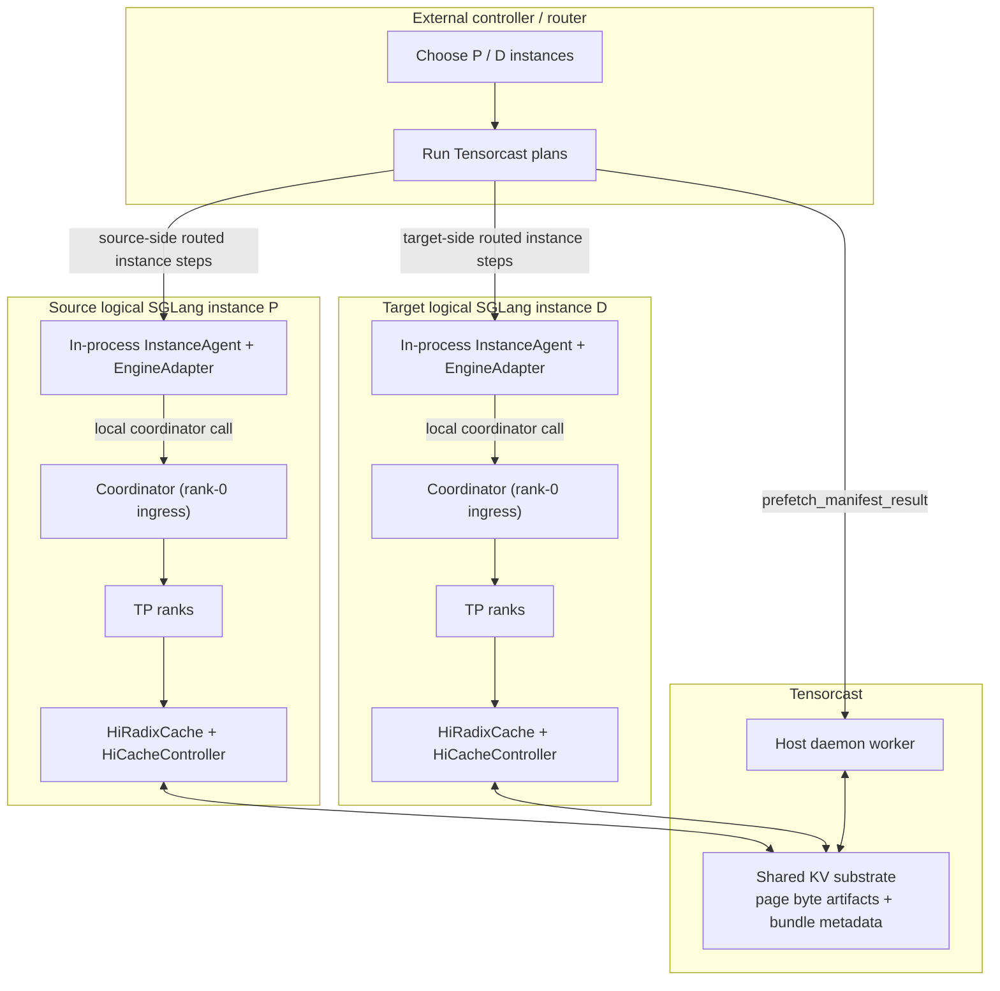

For SGLang v1, the instance-scoped execution host is intentionally modeled
inside the logical SGLang instance boundary:

- the Tensorcast `NodeAgent` semantics are realized as an in-process
  instance-agent,
- the `EngineAdapter` is SGLang-side integration code in that same boundary,
- and the Tensorcast daemon remains the worker/data-plane host rather than the
  owner of instance-step execution.

The standalone Tensorcast `NodeAgent` in the Tensorcast repository should be
treated as a reference implementation of the execution-host contract, not as
the required deployment topology for SGLang.

### 3.5 End-to-end split between hot path and programmable path

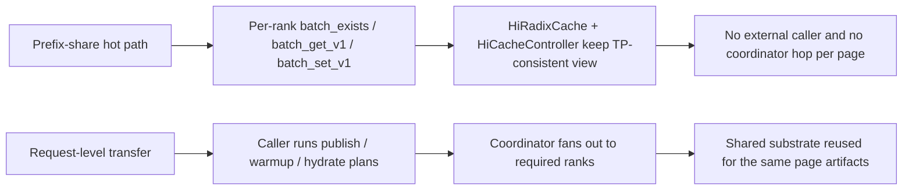

---

## 4) Shared KV Substrate

### 4.1 Shared identity model

The shared substrate SHOULD use:

- **page-level identity** as the stable storage identity,
- **bundle-level identity** as the orchestration identity.

Recommended identity layers:

- **KV page artifact**
  - unit: one page of KV data,
  - stable identity based on SGLang's page hash chain / page hash value.
- **Prefix bundle**
  - unit: an ordered set of KV pages representing a reusable prefix.
- **Request bundle**
  - unit: an ordered set of KV pages sufficient to resume one request on another
    instance.

This lets prefix share and request transfer reuse the same published page
artifacts while exposing different upper-level semantics.

#### 4.1.1 One SGLang page shard maps to one high-cardinality Tensorcast byte artifact

The concrete storage unit inside Tensorcast SHOULD be:

- one rank-local SGLang KV page shard

represented as:

- one Tensorcast byte artifact.

This is intentionally high-cardinality:

- one request bundle may contain many pages,
- one prefix bundle may contain many pages,
- and each page is stored and deduplicated independently.

For `TP > 1`, the unit is still one page shard, not a logical whole-request
tensor and not an all-rank aggregate object.

Therefore:

- the shared substrate stores many page-sized byte artifacts,
- prefix bundles and request bundles are metadata layers over those artifacts,
- and deduplication happens at page-artifact granularity.

#### 4.1.2 Recommended byte-artifact identity contract

Each page artifact SHOULD use:

- a valid Tensorcast byte-artifact `artifact_id`,
- and a `layout_id` that identifies the page serialization contract.

The exact naming scheme is integration-owned, but the artifact identity input
SHOULD be derived from:

- page hash or equivalent content-derived identity,
- model / KV layout family,
- page size,
- dtype / encoding contract,
- and rank-local shard qualifiers such as TP / PP ownership when required.

The `layout_id` SHOULD version the byte-level page format so that:

- incompatible page encodings never silently alias,
- request bundles can reject incompatible pages early,
- and future serialization changes can coexist safely.

### 4.2 Byte-artifact boundary and data ownership

For v1, the ownership boundary is the existing SGLang host/L2 page boundary.

That means:

- SGLang owns the `L1(device) -> L2(host)` movement,
- Tensorcast begins at a frozen host-page view,
- Tensorcast does not own live mutable device KV pages in v1.

The publication boundary for one page shard is:

1. the page is resident in an SGLang host buffer,
2. the integration freezes or snapshots that host-page contents for one
   publication attempt,
3. the shared runtime wraps those bytes as a Tensorcast byte artifact candidate,
4. the shared runtime publishes that candidate into the distributed pool.

The retrieval boundary is the reverse:

1. the shared runtime resolves a page byte artifact from Tensorcast,
2. the bytes are materialized into an SGLang host page buffer,
3. SGLang later decides whether and when to load the page back into device KV
   memory.

#### 4.2.1 Page-to-artifact conversion contract

The SGLang-side shared runtime SHOULD conceptually perform:

1. `host page buffer -> bytes payload`
2. `payload + artifact_id + layout_id -> OpenByteArtifact`
3. `OpenByteArtifact -> SealedByteArtifact`
4. `SealedByteArtifact -> put-if-absent / retain into Tensorcast`

The Tensorcast artifact API already exposes this shape explicitly:

- `OpenByteArtifact`
- `SealedByteArtifact`
- `seal_byte_artifact(...)`

So the design target is not a vague "store some page bytes somewhere". It is:

- convert one frozen SGLang host page shard into one sealed Tensorcast byte
  artifact candidate with explicit invariants,
- then publish or adopt it through the shared runtime.

This is a semantic contract, not a requirement that the hottest path must
literally instantiate Python objects page-by-page.

The implementation MAY use lower-level Tensorcast region-based fast paths such
as host / region `put-if-absent` and region `get-into` operations, provided the
result still obeys the same contract:

- one page shard maps to one byte-artifact identity,
- publication is content-checked and deduplicated at that artifact identity,
- bundle metadata refers to those page artifact identities rather than to opaque
  engine-private buffers.

#### 4.2.2 Data-path graph for one page shard

```mermaid
flowchart LR
    A["SGLang device page shard<br/>(mutable, engine-owned)"]
    B["SGLang host page shard<br/>(L2, publish boundary)"]
    C["Frozen page snapshot<br/>bytes payload"]
    D["OpenByteArtifact<br/>(artifact_id, layout_id, payload)"]
    E["SealedByteArtifact<br/>(payload digest + invariants)"]
    F["Tensorcast shared pool<br/>byte artifact"]
    G["Prefix / request bundle metadata"]

    A -->|"backup / offload"| B
    B -->|"freeze for publication attempt"| C
    C --> D
    D -->|"seal"| E
    E -->|"put-if-absent / adopt / retain"| F
    F --> G
```

#### 4.2.3 Reverse data path for retrieval

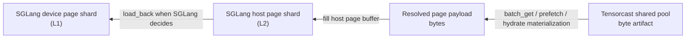

### 4.3 Relationship to current SGLang hashing

The shared substrate SHOULD preserve SGLang's existing page-hash semantics and
prefix-chain hints:

- page hash values derived from token sequences,
- optional `prefix_keys` chain passed to storage backends,
- existing host-page indexing and page-aligned IO behavior.

This avoids inventing a second identity system for the same KV content.

### 4.4 Bundle metadata

The substrate SHOULD support at least two kinds of bundle metadata:

- **Prefix bundle metadata**
  - maps a prefix identity to an ordered set of page artifacts.
- **Request bundle metadata**
  - maps a request-level snapshot to an ordered set of page artifacts plus any
    engine-specific resume metadata required for decode continuation.

Request bundles and prefix bundles MAY share pages.

### 4.5 Manifest alignment

Tensorcast `ManifestResult` and `ManifestArtifactSetBridge` should be treated as
the public/exported representation of bundle metadata when leaving the engine
boundary.

That means:

- the EngineAdapter should not invent an incompatible manifest format,
- request-level `publish()` should return manifests that point back to the same
  underlying page artifacts used by prefix share.

### 4.6 TP>1 shard ownership and rank-qualified storage identity

When `TP > 1`, the shared substrate SHOULD treat per-rank KV shards as distinct
physical objects even when they correspond to the same logical token prefix.

In practice, this means:

- each TP rank continues to own its local device / host page buffers,
- each TP rank continues to own its local radix / host-cache structures,
- physical storage identity MAY include TP/PP rank qualification or an
  equivalent namespace,
- and bundle metadata is responsible for reassembling one logical prefix bundle
  or request bundle from those per-rank shards.

This matches the current SGLang mental model:

- token-prefix identity is shared logically across ranks,
- physical page placement and bytes remain rank-local.

### 4.7 No coordinator on the prefix-share hot path

The shared substrate SHOULD NOT require a central coordinator for ordinary
page-level prefix-share `exists/get/set`.

Instead:

- each rank publishes or fetches its own shard pages,
- SGLang's existing TP synchronization remains authoritative for a common hit
  length, insertion boundary, and completion progress,
- and the coordinator is reserved for higher-level request-bundle operations
  such as programmable `publish` / `hydrate` / `evict_local`.

Coordinator-free hot path does not mean "no synchronization". It means:

- page-level IO stays rank-local,
- while cross-rank consistency continues to use SGLang's existing TP collectives
  and HiCache rules rather than adding a new Tensorcast control hop per page.

### 4.8 Page state models owned by the shared runtime

The shared runtime SHOULD define at least two distinct state models for pages:

- a local placement-oriented state used at the engine / host-buffer boundary,
- a publication-registry state used for deduplication and closure.

These are related but not identical.

#### 4.8.1 Publication-relevant local page placement state

This state compresses the placement information that matters to Tensorcast
integration. It is not intended to mirror every internal SGLang cache detail.

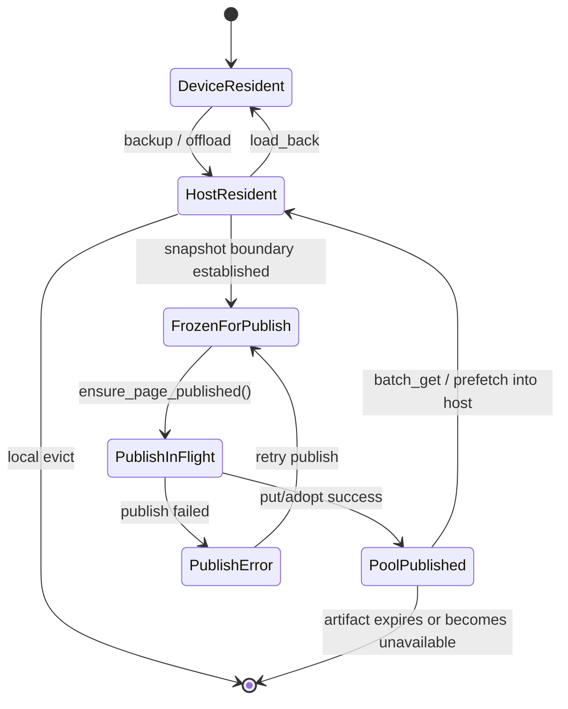

Recommended interpretation:

- `DeviceResident`: page exists only as live engine-side device KV state for the
  purposes of Tensorcast integration.
- `HostResident`: page bytes are present in SGLang host memory and can be used
  for prefix-share read or publication preparation.
- `FrozenForPublish`: the page has an immutable snapshot boundary for one
  publication attempt.
- `PoolPublished`: the shared runtime can treat the page artifact contract as
  satisfied in Tensorcast.

#### 4.8.2 Page publication registry state

This is the per-page coordination state owned by the SGLang-side shared runtime.

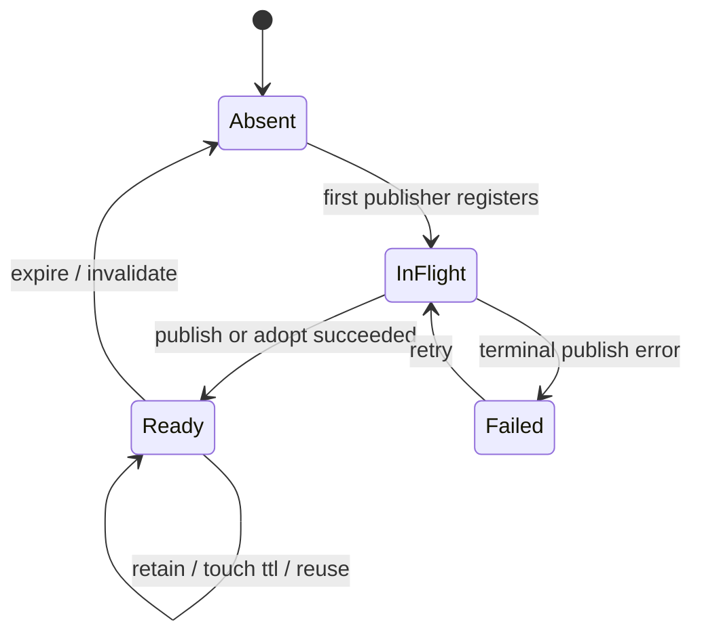

Recommended semantics:

- `Absent`: no usable distributed publication is currently known.
- `InFlight`: some rank or bundle-level workflow is actively trying to satisfy
  the page publication contract.
- `Ready`: the page is published with usable identity and retention.
- `Failed`: the most recent publication attempt failed and should not be treated
  as ready.

---

## 5) Upper Interface A: Prefix Share Data Plane

### 5.1 Design choice

Prefix share SHOULD be integrated as an internal Tensorcast-backed HiCache data
plane, not as an external caller-driven programmable workflow.

Operationally, this means Tensorcast should look more like:

- a Mooncake-style storage backend

than like:

- a per-request external controller action.

### 5.2 Recommended integration point

The recommended SGLang integration boundary is:

- `HiRadixCache` + `HiCacheController`

not just:

- `HiCacheStorage` in isolation.

Reason:

- `HiCacheStorage` only exposes page-store verbs,
- while the real prefix-share semantics also depend on radix-tree ownership,
  prefetch thresholds, cancellation, and insertion semantics controlled by
  `HiRadixCache` and `HiCacheController`.

In practice, the first shippable implementation can still expose a
`TensorCastHiCacheStorage`-like surface, but it should be backed by a shared
runtime that understands the broader KV substrate.

### 5.3 Required backend shape

The prefix-share backend SHOULD provide a Mooncake-like internal API:

- `batch_exists(keys, extra_info)`
- `batch_get_v1(keys, host_indices, extra_info)`
- `batch_set_v1(keys, host_indices, extra_info)`

Key properties:

- batch-oriented,
- page-oriented,
- compatible with host-pool zero-copy or near-zero-copy paths,
- able to honor `prefix_keys` as an additional lookup hint.

### 5.4 v1 memory-hierarchy constraint

For v1, the shared KV substrate SHOULD be integrated at the existing
SGLang HiCache host/L2 boundary.

Concretely, the recommended first implementation is:

- SGLang remains responsible for L1(device) <-> L2(host) movement,
- the Tensorcast-backed shared substrate handles L2(host) <-> distributed pool
  publication and retrieval.

This means v1 does not require:

- direct L1-GPU -> shared-pool zero-copy publish for the prefix-share path,
- direct shared-pool -> L1-GPU zero-copy fetch for the prefix-share path,
- or bypassing SGLang's current host-pool-based HiCache flow.

The reason is pragmatic:

- this keeps the integration minimally invasive to the current SGLang HiCache
  architecture,
- preserves the existing `HiCacheController` / host-pool scheduling model,
- and matches the existing Mooncake-like storage backend contract.

Tensorcast GPU fast paths such as CUDA-IPC-backed mapped-target materialization
remain valuable, but they should be treated as later optimizations or
request-transfer-specific accelerations, not as the baseline assumption for the
v1 prefix-share substrate.

### 5.5 Prefix-share read path

The intended flow is:

1. SGLang matches in-memory prefix using `HiRadixCache`.
2. On storage-backed continuation, SGLang computes page hashes and optional
   prefix chain.
3. The Tensorcast-backed backend checks existence for consecutive pages.
4. Matching pages are fetched into host memory.
5. SGLang inserts the returned pages into its host/radix structures.
6. Later, SGLang loads them from host to device as usual.

This path MUST remain engine-owned and local to SGLang's hot path.

```mermaid
flowchart LR
    A["Request arrives on one logical instance"] --> B["Each TP rank checks in-memory radix state"]
    B --> C["Need more prefix pages from substrate?"]
    C -->|No| D["Continue normal execution"]
    C -->|Yes| E["Per-rank compute page hashes + prefix_keys"]
    E --> F["Tensorcast-backed backend batch_exists(...)"]
    F --> G["SGLang TP sync chooses common hit span"]
    G --> H["Tensorcast-backed backend batch_get_v1(...) into host pages"]
    H --> I["Each rank inserts fetched host pages into radix / host cache"]
    I --> J["SGLang later load_back host->device if needed"]
    J --> D
```

### 5.6 Prefix-share write path

The intended flow is:

1. SGLang backs up KV pages from device to host as it already does.
2. On write-through or write-back-to-storage, the Tensorcast-backed backend
   publishes those pages into the shared KV substrate.
3. The storage publication records page identity and, when available, prefix
   chain hints.

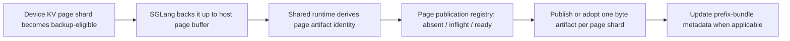

### 5.7 Why this should not use external plans

Using an external caller and `Plan` for synchronous prefix share would be a bad
fit because:

- prefix share is too frequent,
- the hot path needs internal partial-progress handling,
- SGLang already owns scheduling and memory admission,
- `Plan` is a control-plane abstraction, not a per-page low-latency data-plane
  primitive.

### 5.8 Optional programmability for prefix bundles

Programmability can still help for prefix share, but only at a coarse
granularity such as:

- prewarming a known popular prefix bundle to selected nodes,
- debugging or inspecting prefix-bundle availability,
- background repair or rollout.

This is optional and is not the main synchronous prefix-hit path.

---

## 6) Upper Interface B: Request-level Transfer Control Plane

### 6.1 Design choice

Request-level transfer SHOULD use Tensorcast programmability plus an in-process
SGLang instance-agent / EngineAdapter integration.

This is the right place for:

- `publish(engine_request_id=...)`
- `hydrate(engine_request_id=...)`
- `evict_local(engine_request_id=...)`
- optional `prefetch_manifest_result(...)`

For the current Tensorcast caller surface, request-bundle retention intent is
carried by the `ttl_ms` argument on `publish(...)`, not by `CallContext`.

### 6.2 Logical instance mapping for TP>1

For request-level transfer, a Tensorcast `instance_id` SHOULD represent one
logical SGLang serving instance / TP group, not one TP-rank process.

Therefore:

- the external caller sees one `instance_id` for one logical instance,
- the external caller issues one `publish` / `hydrate` / `evict_local` call per
  logical instance,
- per-rank fan-out and aggregation stay inside the SGLang integration.

This mapping keeps the controller contract stable even when one SGLang serving
instance internally contains multiple TP ranks.

### 6.3 Coordinator role and external semantics

The request-transfer path SHOULD introduce one SGLang-side coordinator per
logical instance.

The recommended coordinator is the rank-0 control-plane ingress for that TP
group.

Its responsibilities are:

- accept one group-scoped Tensorcast instance-step call for the logical
  `instance_id`,
- validate request identity and layout compatibility,
- fan the operation out to all required ranks,
- gather per-rank results,
- build one group-level `PublishResult`, `HydrateResult`, or `BatchResult`,
- define one success/fail outcome for the whole logical instance.

For standard MHA layouts, the required-rank set is usually all TP ranks. For
layouts such as MLA, the integration MAY optimize which ranks physically publish
pages, but the public programmable semantics remain group-scoped.

### 6.4 Coordinator-to-rank communication path

The preferred implementation is to reuse SGLang's native control-plane path
from the in-process instance-agent boundary rather than letting the Tensorcast
daemon side or a separate helper independently contact each TP-rank process.

Concretely, the recommended flow is:

1. The in-process instance-agent / EngineAdapter receives `publish`,
   `manifest`, `hydrate`, or `evict_local` for one logical Tensorcast
   `instance_id`.
2. The adapter calls a local SGLang coordinator endpoint for that logical
   instance.
3. The coordinator uses SGLang's existing rank-0 control ingress and internal
   broadcast path to fan the request out to other ranks.
4. Each required rank performs its local shard operation.
5. The coordinator gathers the per-rank results and returns one group-level
   result back through the adapter.

The integration SHOULD avoid ad-hoc direct networking from the instance-agent
boundary to every rank process. The fan-out contract should stay inside
SGLang's native coordinator path.

For quick experiments, a generic collective RPC path is acceptable. For the
real integration, SGLang SHOULD define typed internal request/output objects for
KV publish / manifest / hydrate / evict so that structured results, not just
boolean success, can be returned.

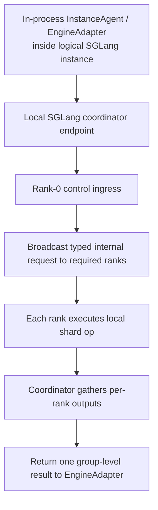

### 6.5 Data reuse rule

Request-level transfer MUST reuse the shared KV substrate, not create a second
separate storage universe.

That means:

- source-side `publish()` should describe a request bundle over already-stored or
  newly-stored page artifacts,
- target-side `hydrate()` should reconstruct engine-local runtime state from
  those same page artifacts,
- optional worker warmup should prefetch those same artifacts.

### 6.6 Mixed-state handling between passive page writes and active publish

The integration MUST explicitly support a mixed state where:

- some KV pages have already been passively written into the shared substrate by
  prefix-share or write-through activity,
- some pages are currently in-flight through that passive path,
- and some pages are still absent.

This mixed state is normal and SHOULD be the expected steady-state behavior of a
shared substrate.

Therefore request-level `publish()` MUST NOT mean:

- "upload every page from scratch"

It MUST mean:

- establish a complete request bundle closure over the shared substrate.

Concretely, source-side `publish()` should:

1. freeze the request snapshot boundary,
2. enumerate the full required page set,
3. for each page:
   - reuse it if already ready,
   - join or adopt compatible in-flight publication when possible,
   - publish it if missing,
   - and upgrade retention when mere existence is not sufficient,
4. commit the request-bundle manifest only after closure is satisfied.

This gives the two upper interfaces different semantic strength:

- passive prefix-share writes:
  - opportunistic,
  - page-level,
  - best-effort population of the shared substrate.
- active request-level `publish()`:
  - bundle-level,
  - closure-establishing,
  - responsible for completeness and transfer retention.

### 6.7 Request-level publish flow

The recommended source-side publish flow is:

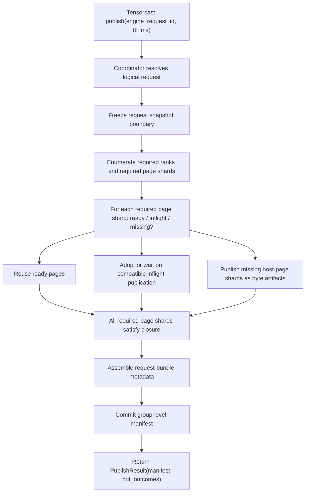

Failure boundary:

- the flow fails before `K` if any required rank or required page shard cannot
  satisfy closure,
- partial page success does not imply request-bundle success.

### 6.8 Request-level hydrate flow

The recommended target-side hydrate flow is:

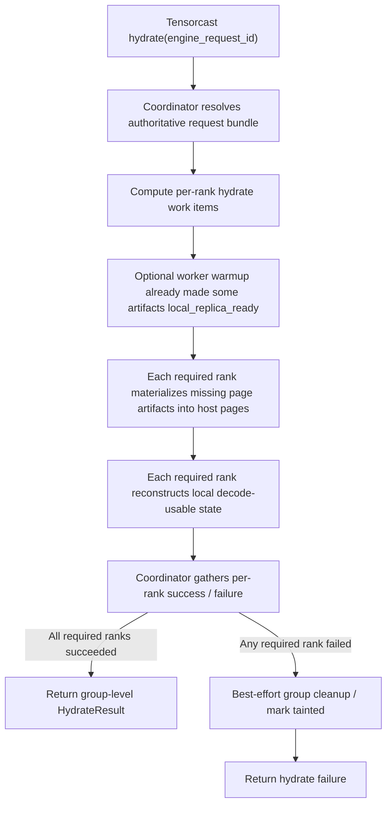

### 6.9 Instance-agent and EngineAdapter role

In the SGLang v1 design, the Tensorcast instance-step execution boundary is an
in-process instance-agent hosted inside the logical SGLang instance. That
instance-agent receives the routed Tensorcast instance step and delegates the
actual SGLang-specific translation work to the EngineAdapter.

The SGLang EngineAdapter is responsible for translating Tensorcast instance
steps into SGLang operations:

- `publish`
  - identify the group-scoped request KV live state,
  - invoke coordinator fan-out when the logical instance has multiple ranks,
  - ensure relevant pages exist in the shared KV substrate,
  - produce one group-level request-bundle manifest output.
- `hydrate`
  - resolve the authoritative request bundle,
  - invoke coordinator fan-out when the logical instance has multiple ranks,
  - fetch or locate required pages,
  - reconstruct target-side decode-usable KV state across all required ranks.
- `evict_local`
  - remove local engine-side request state after handoff or cleanup across the
    whole logical instance.

The EngineAdapter is therefore the bridge from:

- Tensorcast's one-instance-step / one-`instance_id` public surface

to:

- SGLang's potentially multi-rank internal execution model.

The Tensorcast daemon is not the owner of this translation logic. It may remain
the worker-step and shared-substrate host on the same node, but the
instance-step execution host belongs to the SGLang instance boundary.

### 6.10 Request bundle vs prefix bundle

A request bundle is not identical to a prefix bundle.

A request bundle MAY contain:

- a suffix beyond a reusable shared prefix,
- request-scoped decode state,
- engine-specific metadata needed for resume.

But request bundles SHOULD reuse underlying prefix/shared pages whenever
possible.

---

## 7) Shared Runtime Component

### 7.1 Why a shared runtime is useful

To avoid duplicating logic, both upper interfaces should call into one shared
SGLang-side Tensorcast KV runtime component.

This component would own:

- page publication and retrieval,
- bundle metadata assembly and resolution,
- Tensorcast-specific keying and artifact operations,
- translation between SGLang page hashes and Tensorcast artifact identity.

This shared runtime component MUST live on the SGLang integration side. It is
not a Tensorcast-core responsibility.

### 7.2 Suggested responsibilities

The shared runtime should expose internal operations such as:

- ensure page artifacts are published,
- fetch page artifacts into host pages,
- build prefix bundle metadata,
- build request bundle metadata,
- resolve request bundle by transfer handle or request handle,
- resolve prefix bundle by prefix identity.

For request-level transfer, this shared runtime SHOULD also provide a
coordinator-facing API that can:

- freeze a request snapshot boundary,
- enumerate required ranks and shard contributions,
- assemble one group-level request bundle manifest,
- resolve one group-level request bundle back into per-rank hydrate work items.

It SHOULD also own a **page publication registry** or equivalent deduplication
mechanism for SGLang-side publication work.

This registry is an SGLang-integration concern, not a Tensorcast-core feature.

Its purpose is to coordinate SGLang-side page publication attempts so that:

- passive prefix-share writes and active request-level publish can deduplicate by
  page identity,
- active publish can observe compatible in-flight passive publication,
- retention upgrades can be applied without pretending that "already exists"
  always means "publish contract already satisfied".

The exact implementation is flexible, but it SHOULD behave like a per-page
publication coordination table with states such as:

- absent,
- in-flight,
- ready,
- failed.

The exact Python module layout is flexible, but the logic should not be split
independently across:

- a storage backend implementation,
- an EngineAdapter implementation,
- and controller-specific helpers

without a shared source of truth.

### 7.3 Bundle state models

The shared runtime SHOULD define explicit lifecycle states for both prefix
bundles and request bundles. These state machines are not Tensorcast-core
objects; they are SGLang integration state.

#### 7.3.1 Prefix bundle state

Prefix bundles are background or hot-path share metadata over already-published
or newly-published page artifacts.

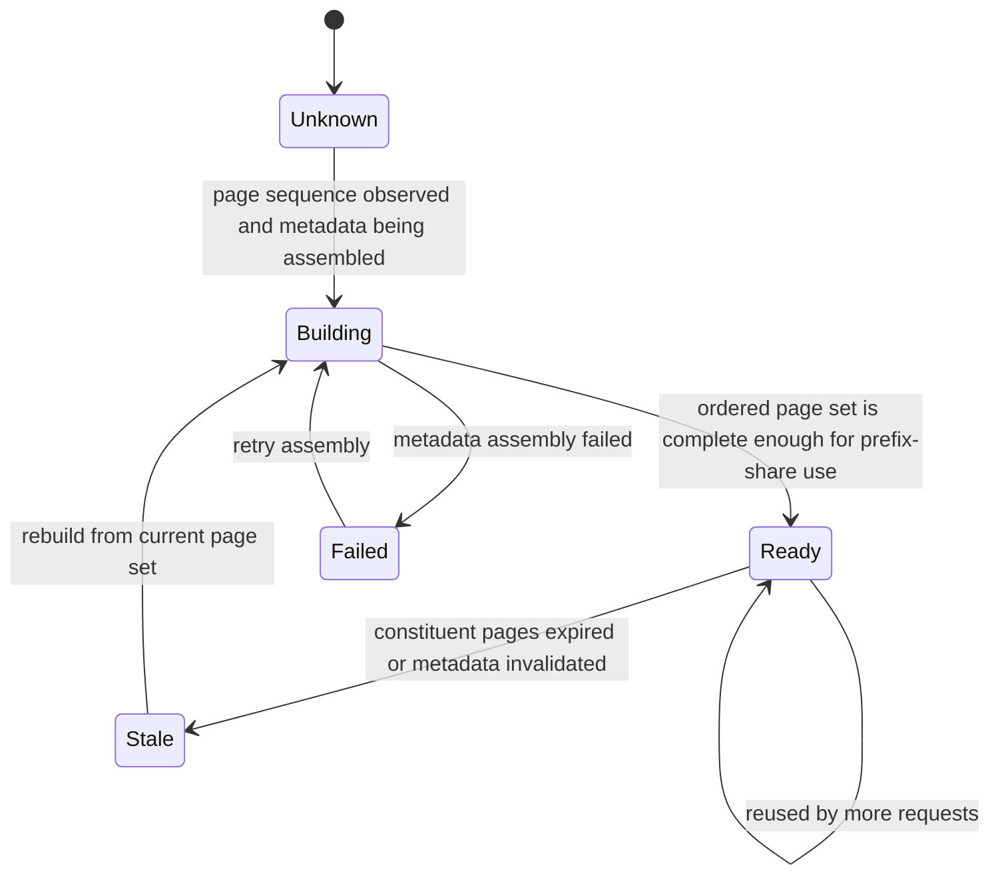

Recommended semantics:

- `Ready` means the bundle can answer prefix-share existence / fetch queries.
- `Stale` means the bundle name may still exist logically, but its page closure
  is no longer trusted.

#### 7.3.2 Request bundle state

Request bundles are stronger than prefix bundles because they must satisfy
decode-resume closure for one logical request.

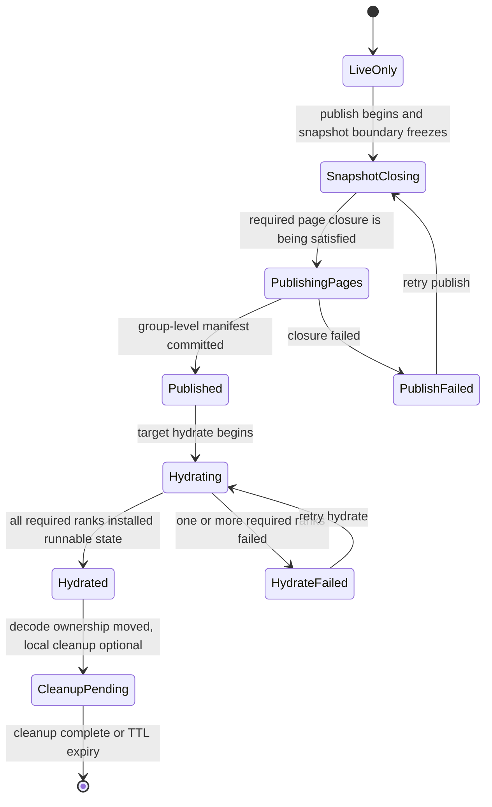

Recommended interpretation:

- `Published` is the first state in which a request bundle is externally
  authoritative for request-level transfer.
- `Hydrated` is target-local success, not global workflow completion.
- `CleanupPending` keeps request-level transfer semantics separate from source
  or target local eviction policy.

---

## 8) Fit With Current Tensorcast Capabilities

### 8.1 What Tensorcast already provides

Current Tensorcast already provides the right building blocks for the
request-level control plane:

- runtime-bound `Plan`,
- worker `prefetch_set` / `prefetch_manifest_result`,
- instance `publish` / `hydrate` / `evict_local`,
- `ManifestResult` and `ManifestArtifactSetBridge`.

This is sufficient to define the public request-transfer protocol.

### 8.2 What Tensorcast does not yet directly provide

Current Tensorcast does not yet directly provide all the primitives needed for
the prefix-share hot path.

The main gaps are:

- a public page-store-style batch API tailored for high-cardinality KV page IO,
- an existing Tensorcast-backed HiCache storage implementation,
- explicit public prefix-bundle programmability,
- a public hydrate-by-manifest or hydrate-by-artifact-set instance-step surface.

### 8.3 Design consequence

Because of these gaps, the recommended implementation strategy is:

- build the prefix-share path as an internal SGLang integration over Tensorcast
  storage/artifact primitives,
- while using current Tensorcast programmability for request transfer with as
  little Tensorcast-core extension as possible.

---

## 9) Recommended Implementation Order

### 9.1 Phase 1: shared substrate + prefix-share backend

Implement:

- the shared SGLang-side Tensorcast KV runtime,
- page publication/retrieval,
- a Tensorcast-backed prefix-share backend compatible with
  `HiCacheController`.

Goal:

- make Tensorcast usable as the distributed KV pool for prefix share.

### 9.2 Phase 2: request-level EngineAdapter

Implement:

- SGLang in-process instance-agent / EngineAdapter `publish`,
- SGLang in-process instance-agent / EngineAdapter `hydrate`,
- SGLang in-process instance-agent / EngineAdapter `evict_local`,
- coordinator-side typed internal control requests for KV publish / manifest /
  hydrate / evict,
- request-bundle manifest construction on top of the same page artifacts.

Goal:

- enable PD transfer using the protocol in
  `tensorcast_kv_protocol.md`.

### 9.3 Phase 3: optional programmable prefix bundle operations

If useful later, add coarse-grained programmability for prefix bundles, such as:

- prefix-bundle prewarm,
- rollout to selected nodes,
- debugging and inspection.

This phase is optional and should not block the main two-path integration.

---

## 10) Non-goals and Guardrails

The integration SHOULD avoid these failure modes:

- building one Tensorcast path for prefix share and a separate incompatible path
  for request transfer,
- treating `engine_request_id` as the stable distributed identity for KV pages,
- exposing one Tensorcast `instance_id` per TP rank to the external caller for
  request transfer,
- routing ordinary prefix-share page IO through the request-transfer
  coordinator,
- routing synchronous prefix-hit traffic through external callers and `Plan`,
- reducing Tensorcast to only a thin `HiCacheStorage` replacement without
  reusing it in request-level transfer.

The core guardrail is simple:

- one distributed KV substrate,
- two upper interfaces,
- one consistent identity model.

---

## 11) Summary

The recommended Tensorcast + SGLang KV integration is:

- **shared bottom layer**
  - page artifacts, bundle metadata, shared distributed KV pool.
- **upper interface A: prefix share**
  - internal SGLang hot path,
  - Mooncake-like batch exists/get/set,
  - no per-request external programmability.
- **upper interface B: request transfer**
  - external caller-driven Tensorcast programmability,
  - coordinator-backed logical-instance `publish` / `hydrate` / `evict_local`,
  - optional worker warmup via `prefetch_manifest_result(...)`.

This is the intended design baseline for the implementation work that follows.
