# Tensorcast KV Integration Design (SGLang)

This document describes the **recommended integration design** for SGLang KV
cache with Tensorcast.

It complements the protocol document:
- `sglang/docs/tensorcast/tensorcast_kv_protocol.md`

Protocol vs design split:
- The protocol document freezes the external contract and target semantics.
- This design document explains how SGLang and Tensorcast should be connected
  internally to realize those semantics.

Status:
- This document now mixes two states:
  - the currently implemented prefix-share substrate in this repo,
  - and the request-transfer design whose runtime path and local
    external-caller validation are implemented in-repo, while remote
    end-to-end validation is still pending.
- Implemented today in the SGLang repo:
  - `python/sglang/srt/mem_cache/storage/tensorcast_store/`
  - `python/sglang/srt/tensorcast/{instance_ops,request_bundle}/`
  - `python/sglang/test/tensorcast/`
  - byte-artifact-native `batch_exists(...)`
  - byte-artifact-native `batch_set_v1(...)`
  - byte-artifact-native `batch_get_v1(...)`
  - persistent `HOST_SHARED` scratch-slab transport for host-backed batch
    `put/get`
  - allocator-backed `HOST_SHARED` host residency with `page_blob_direct`,
    direct slot-based `put/get`, and generation-guarded slot lifetime
  - optional one-time `cudaHostRegister(...)` on allocator-backed exported slabs
  - `benchmark/tensorcast_benchmark/kv/share_local` automation for
    `tensorcast-daemon-mode=share|separate`, explicit benchmark `rid`,
    source-publication-drain tracking, and overlap-mode request-pair driving
- Current Tensorcast core already exposes the request-transfer surfaces
  `publish(engine_request_id=...)`, `PublishResult.publish_manifest`,
  `EngineOwnedManifest`, canonical `hydrate(publish_manifest=...)`,
  compatibility `hydrate(engine_request_id=...)`, `evict_local(...)`, and
  generic `ManifestResult`.
- Implemented today on the SGLang side for request transfer:
  - local-rank request-bundle state, page-publication registry, publish
    closure, hydrate prepare, prepared-bundle claim, and `evict_local(...)`
    state machines,
  - real `Scheduler` lifecycle wiring for local live-request tracking and
    prepared-bundle claim / cleanup,
  - rank-0 live scheduler runtime fanout / aggregation for `publish`,
    `hydrate`, and `evict_local` over SGLang's existing collective RPC /
    object-group control path,
  - a `launch_server()`-managed instance-agent sidecar gRPC ingress plus
    coordinator-owned directory registration / heartbeat for a dedicated
    `instance_agent_execution_endpoint`,
  - host-resident hydrate install plus ordinary `/generate(rid)` prepared-bundle
    claim / consume on the normal HiRadix path,
  - explicit `dp_size == 1` restriction for that first runtime path,
  - and local external-caller end-to-end validation via
    `benchmark/tensorcast_benchmark/kv/request_transfer/`.
- Remaining request-transfer work is now:
  - remote controller-driven end-to-end validation on real instances,
  - and any follow-up hardening discovered from that validation.

---

## 1) Executive Summary

The recommended design is:

- **one shared Tensorcast-backed KV data plane**
- with **two upper interfaces**

The two upper interfaces are:

1. **Prefix share data plane**
   - used on the hot path when SGLang serves requests and finds storage-backed
     prefix hits,
   - integrated into `HiRadixCache` + `HiCacheController`,
   - shaped like a Mooncake-style storage backend,
   - not driven by an external Tensorcast caller program per request.
2. **Request-level transfer control plane**
   - used for controller-driven prompt-prefix publication / hydrate between
     ordinary serving instances,
   - driven by an external caller/controller/router,
   - expressed through Tensorcast instance steps such as `publish`,
     `hydrate`, and `evict_local`,
   - optionally augmented with worker-side `prefetch_manifest_result(...)`.

The key design rule is:

- these two upper interfaces MUST share the same underlying distributed KV pool,
  the same page identity, and the same bundle/manifest semantics.

Tensorcast must therefore not be reduced to only:

- a programmable controller surface, or
- a Mooncake-like storage adapter.

It must serve both roles on top of one shared KV substrate.

---

## 2) Why Two Upper Interfaces Are Necessary

### 2.1 Prefix share and request transfer are different workloads

Although both operate on KV cache, they have very different execution patterns:

- **Prefix share**
  - high-frequency,
  - latency-sensitive,
  - executed inside the serving engine hot path,
  - naturally batched at page granularity,
  - tightly coupled to host-pool allocation, prefetch throttling, and radix-tree
    insertion.
- **Request-level transfer**
  - lower-frequency,
  - control-plane orchestrated,
  - spans multiple serving instances,
  - needs explicit publish / hydrate lifecycle,
  - benefits from external caller logic and programmability.

Trying to force both onto one interface leads to a bad outcome in both
directions:

- using external `Plan` orchestration for every prefix share would be too heavy,
- using only a storage backend API would hide Tensorcast's instance-step
  programmability and make PD transfer awkward.

### 2.2 Why the SGLang hot path should stay internal

Current SGLang prefix-share behavior already lives in:

- `HiRadixCache` for prefix/radix/node ownership,
- `HiCacheController` for host/device/storage movement,
- `HiCacheStorage` backends for page-store operations.

This path includes engine-local policies such as:

- prefetch thresholds,
- prefetch cancellation,
- host memory quota,
- TP synchronization,
- partial progress and insertion into the radix tree.

This is the natural place for Tensorcast-backed prefix share.

### 2.3 Why request transfer still wants programmability

For PD-disaggregated inference, an external caller must be able to:

- choose source and target instances,
- sequence prefill and decode,
- publish request-scoped KV state,
- optionally prewarm the target host daemon,
- hydrate the target ordinary serving instance,
- decide cleanup and retry behavior.

This is precisely the kind of control-plane orchestration that Tensorcast
programmability is good at.

---

## 3) Architecture Overview

### 3.1 Layering

The integration should be organized as:

1. **Shared KV substrate**
   - Tensorcast-backed distributed storage pool for KV pages and bundles.
2. **Prefix share interface**
   - internal SGLang data-plane integration for page-level share.
3. **Request transfer interface**
   - external Tensorcast programmability integration for request-level transfer.

### 3.2 Shared substrate responsibilities

The shared substrate owns:

- page-level identity,
- publication and retrieval of KV page artifacts,
- prefix-bundle metadata,
- generic artifact-manifest data for request-level transfer,
- consistency between storage-backed prefix share and request-level transfer.

The substrate MUST be the single source of truth for distributed KV objects.

Engine-owned request-resume metadata is intentionally not modeled as a separate
Tensorcast dataplane artifact. It is carried in the request-transfer control
plane as `EngineOwnedManifest`.

### 3.3 Upper interface responsibilities

The prefix share interface owns:

- hot-path existence queries,
- page-level get/set,
- host-pool materialization,
- insertion back into SGLang's in-memory radix structures.

The request transfer interface owns:

- instance-scoped publish/hydrate semantics,
- external control-plane sequencing,
- optional worker warmup,
- explicit request handoff lifecycle.

### 3.4 Component graph

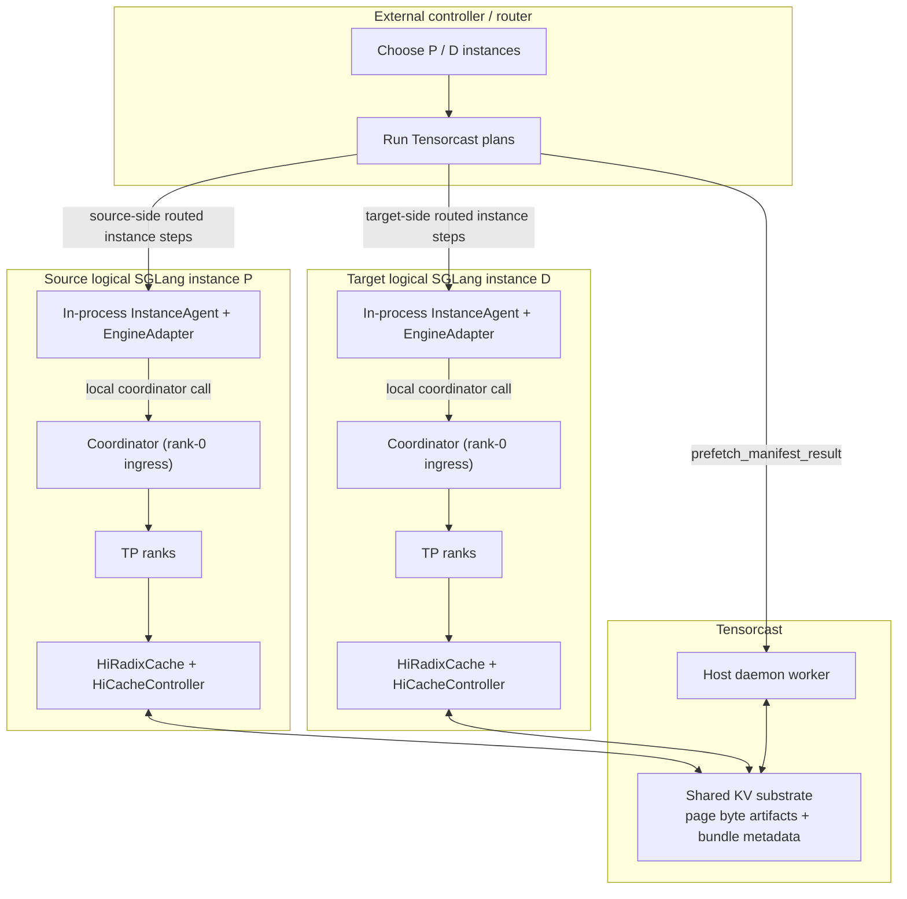

For SGLang v1, the instance-scoped execution host is intentionally modeled
inside the logical SGLang instance boundary:

- the Tensorcast `NodeAgent` semantics are realized as an in-process
  instance-agent,
- the `EngineAdapter` is SGLang-side integration code in that same boundary,
- and the Tensorcast daemon remains the worker/data-plane host rather than the
  owner of instance-step execution.

The standalone Tensorcast `NodeAgent` in the Tensorcast repository should be
treated as a reference implementation of the execution-host contract, not as
the required deployment topology for SGLang.

### 3.5 End-to-end split between hot path and programmable path

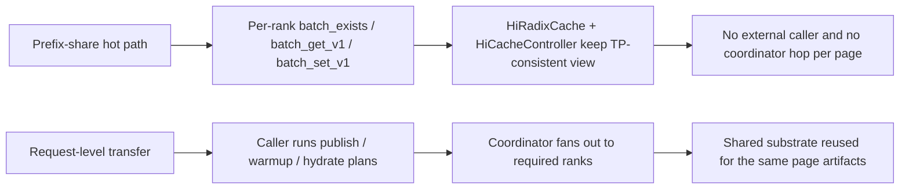

### 3.6 Coordinator-owned directory registration and liveness

For request-level transfer, the rank-0 coordinator SHOULD own the Tensorcast
directory-facing lifecycle of the logical SGLang instance.

Why this ownership is recommended:

- the coordinator is the public control-plane ingress for the logical instance,
- the coordinator also owns the instance-agent sidecar execution endpoint,
- the coordinator and the logical SGLang serving instance are intended to share
  one lifecycle boundary,
- and if rank 0 dies, the logical instance should stop being routable for
  Tensorcast instance-step execution.

Recommended route-registration schema:

```yaml
tensorcast_directory:
  instance_id: sgl-inst-17
  daemon_id: daemon-a
  engine: sglang
  execution_host_kind: node_agent_grpc
  execution_endpoint: 10.0.0.5:7310
  capability_flags:
    - instance_publish
    - instance_hydrate
    - instance_evict_local
    - execution_signals

sglang_side_metadata:
  serving_http_endpoint: http://10.0.0.5:30000
  tp_size: 8
  pp_size: 1
  coordinator_rank: 0
  coordinator_epoch: 0195c9d4-6e7a-7b91-b3b5-8f91f9d90d62
  lifecycle_state: ready
```

Recommended ownership rules:

- only rank 0 registers and heartbeats the logical Tensorcast `instance_id`,
- other TP ranks remain internal workers behind that one logical instance,
- `execution_endpoint` points at the coordinator-hosted instance-agent sidecar
  ingress launched by `launch_server()`,
- and `serving_http_endpoint` remains SGLang-owned discovery metadata rather
  than a required Tensorcast directory field.

Recommended lifecycle state machine:

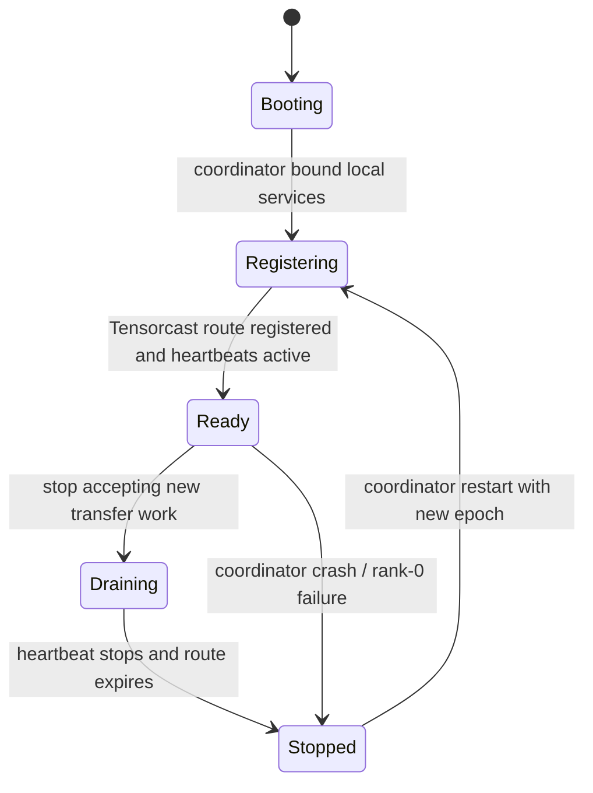

Recommended registration flow:

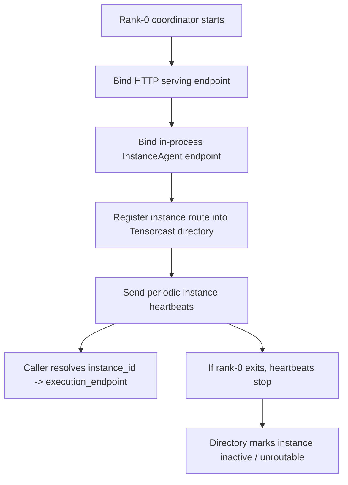

---

## 4) Shared KV Substrate

### 4.1 Shared identity model

The shared substrate SHOULD use:

- **page-level identity** as the stable storage identity,
- **bundle-level identity** as the orchestration identity.

Recommended identity layers:

- **KV page artifact**
  - unit: one page of KV data,
  - stable identity based on SGLang's page hash chain / page hash value.
- **Prefix bundle**
  - unit: an ordered set of KV pages representing a reusable prefix.
- **Request bundle**
  - unit: an ordered set of KV pages sufficient to resume one request on another
    instance.

This lets prefix share and request transfer reuse the same published page
artifacts while exposing different upper-level semantics.

#### 4.1.1 One SGLang page shard maps to one high-cardinality Tensorcast byte artifact

The concrete storage unit inside Tensorcast SHOULD be:

- one rank-local SGLang KV page shard

represented as:

- one Tensorcast byte artifact.

This is intentionally high-cardinality:

- one request bundle may contain many pages,
- one prefix bundle may contain many pages,
- and each page is stored and deduplicated independently.

For `TP > 1`, the unit is still one page shard, not a logical whole-request
tensor and not an all-rank aggregate object.

Therefore:

- the shared substrate stores many page-sized byte artifacts,
- prefix bundles and request bundles are metadata layers over those artifacts,
- and deduplication happens at page-artifact granularity.

#### 4.1.2 Recommended byte-artifact identity contract

Each page artifact SHOULD use:

- a valid Tensorcast byte-artifact `artifact_id`,
- and a `layout_id` that identifies the page serialization contract.

The exact naming scheme is integration-owned, but the artifact identity input
SHOULD be derived from:

- the engine-owned logical page identity rather than from payload bytes,
- model / KV layout family,
- model version or served checkpoint revision,
- page size,
- dtype / encoding contract,
- and rank-local shard qualifiers such as TP / PP ownership when required.

For SGLang KV pages, the recommended recipe is:

- `artifact_id = cgid:byte_artifact~<namespace>~sglang~<model_id_enc>~<model_version_enc>~<layout_id>~<engine_key_enc>`
- `layout_id` MUST version the byte-level page format and MUST encode:
  - layout family,
  - attention family,
  - dtype,
  - page size,
  - and any explicit serialization-version bump,
- `engine_key_enc` MUST encode:
  - the logical page key derived from SGLang token-page hashing,
  - plus TP / PP shard qualifiers,
- `artifact_id` MUST NOT include run-local identity such as:
  - `run_id`,
  - `instance_id`,
  - `daemon_id`,
  - or host identity.

The `layout_id` SHOULD version the byte-level page format so that:

- incompatible page encodings never silently alias,
- request bundles can reject incompatible pages early,
- and future serialization changes can coexist safely.

### 4.2 Byte-artifact boundary and data ownership

For v1, the ownership boundary is the existing SGLang host/L2 page boundary.

That means:

- SGLang owns the `L1(device) -> L2(host)` movement,
- Tensorcast begins at a frozen host-page view,
- Tensorcast does not own live mutable device KV pages in v1.

The publication boundary for one page shard is:

1. the page is resident in an SGLang host buffer,
2. the integration freezes or snapshots that host-page contents for one
   publication attempt,
3. the shared runtime wraps those bytes as a Tensorcast byte artifact candidate,
4. the shared runtime publishes that candidate into the distributed pool.

The retrieval boundary is the reverse:

1. the shared runtime resolves a page byte artifact from Tensorcast,
2. the bytes are materialized into an SGLang host page buffer,
3. SGLang later decides whether and when to load the page back into device KV
   memory.

#### 4.2.1 Page-to-artifact conversion contract

The SGLang-side shared runtime SHOULD conceptually perform:

1. `host page buffer -> bytes payload`
2. `payload + artifact_id + layout_id -> OpenByteArtifact`
3. `OpenByteArtifact -> SealedByteArtifact`
4. `SealedByteArtifact -> put-if-absent / retain into Tensorcast`

The Tensorcast artifact API already exposes this shape explicitly:

- `OpenByteArtifact`
- `SealedByteArtifact`
- `seal_byte_artifact(...)`

So the design target is not a vague "store some page bytes somewhere". It is:

- convert one frozen SGLang host page shard into one sealed Tensorcast byte
  artifact candidate with explicit invariants,
- then publish or adopt it through the shared runtime.

This is a semantic contract, not a requirement that the hottest path must
literally instantiate Python objects page-by-page.

The implementation MAY use lower-level Tensorcast region-based fast paths such
as batch region `put-if-absent` and region `get-into` operations, provided the
result still obeys the same contract:

- one page shard maps to one byte-artifact identity,
- publication is deduplicated at that artifact identity under the declared join
  mode,
- bundle metadata refers to those page artifact identities rather than to opaque
  engine-private buffers.

For SGLang KV pages, the recommended join mode is:

- `BYTE_ARTIFACT_VERIFICATION_MODE_LAYOUT_AND_SIZE_ONLY`

This means:

- the routed join key is `{artifact_id, layout_id, byte_length}`,
- payload digests are optional debug or observability metadata rather than join
  truth,
- repeated publication of the same logical page is first-writer-wins or
  adopt-existing,
- and `batch_set_v1(...)` MUST NOT be interpreted as upsert for an already
  published logical page.

In the current codebase, the high-throughput batch region path is already
host-native for SGLang prefix share:

- `BatchPutIfAbsentFromRegion(...)` accepts `HOST_SHARED` sources,
- `BatchGetIntoRegion(...)` accepts `HOST_SHARED` targets,
- and the active SGLang Tensorcast backend no longer uses a VRAM-staging fast
  path.

#### 4.2.2 Data-path graph for one page shard

```mermaid
flowchart LR
    A["SGLang device page shard<br/>(mutable, engine-owned)"]
    B["SGLang host page shard<br/>(L2, publish boundary)"]
    C["Frozen page snapshot<br/>bytes payload"]
    D["OpenByteArtifact<br/>(artifact_id, layout_id, payload)"]
    E["SealedByteArtifact<br/>(payload digest + invariants)"]
    F["Tensorcast shared pool<br/>byte artifact"]
    G["Prefix bundle metadata / PublishManifest"]

    A -->|"backup / offload"| B
    B -->|"freeze for publication attempt"| C
    C --> D
    D -->|"seal"| E
    E -->|"put-if-absent / adopt / retain"| F
    F --> G
```

#### 4.2.3 Reverse data path for retrieval

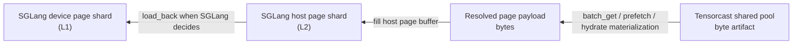

#### 4.2.4 Current implementation: byte-artifact-native substrate over `HOST_SHARED` regions

This is the current implementation strategy in the SGLang repo:

- `batch_exists(...)` uses Tensorcast `BatchExists(...)`,
- `batch_set_v1(...)` uses `BatchPutIfAbsentFromRegion(...)`,
- `batch_get_v1(...)` uses `BatchGetIntoRegion(...)`,
- the active data path is `HOST_SHARED`, not VRAM staging,
- and the steady-state prefix-share path no longer goes through generic
  `tc.Store.put(..., key=...)` / tensor fetch APIs.

The shared substrate is byte-artifact-native end to end:

- page existence is checked by byte-artifact identity,
- page publication is performed by byte-artifact put-if-absent,
- page retrieval is performed by byte-artifact get-into,
- and prefix/request metadata refers to page artifact identities rather than to
  Tensor-valued `key=` artifacts.

Today the SGLang backend has two host-native execution modes built on the same
`HOST_SHARED` region model:

1. **scratch-slab mode**
   - used when HiCache L2 pages live in ordinary host memory,
   - SGLang copies between ordinary L2 pages and one long-lived
     Tensorcast-exported `HOST_SHARED` scratch slab per rank.
2. **allocator-backed direct mode**
   - used when `host_allocator_enabled=true`,
   - requires `page_blob_direct` plus a live exported host-region binding,
   - publishes directly from resident slot offsets and fetches directly into
     reserved destination slots on the exported slab.

The active backend path should not treat the following as the steady-state hot
path for prefix share:

- generic `tc.Store.put(..., key=...)` / `artifact(key=...).tensor(...)`,
- `HomeBatchPutIfAbsent(...)`,
- `HomeBatchGet(...)`.

Those paths remain useful for fallback, bring-up, and debugging, but they are
not the intended high-cardinality page IO path because they operate through
payload bodies rather than through client-owned region-backed batch transfer.

#### 4.2.5 Current write path

For one publication batch, the current write-side flow is:

1. SGLang offloads or backs up mutable L1 device KV into stable L2 host pages.
2. The Tensorcast-backed backend selects one ordered batch of rank-local page
   shards to publish.
3. For each page shard, the backend derives:
   - byte-artifact `artifact_id`,
   - `layout_id`,
   - byte length,
   - `PUT_IF_ABSENT` verification mode,
   - and optional payload digest metadata when enabled for debugging or
     observability.
4. The backend chooses one of two host-native source layouts:
   - ordinary-host mode: copy pages into one persistent `HOST_SHARED` scratch
     slab with one contiguous slice per page shard,
   - allocator-backed mode: reference resident exported-slab slot offsets
     directly.
5. The backend issues one `BatchPutIfAbsentFromRegion(...)` call with:
   - one item per page shard,
   - one coalesced `source_layout`,
   - explicit per-item invariants.
6. Per-item outcomes update the SGLang-side batch publication result:
   - `ready` for newly published or already-existing pages,
   - `failed` for publication errors.

In the current prefix-share implementation, this is realized as the
`batch_set_v1(...)` success mask plus duplicate/failure accounting rather than
as the full Phase-3 request-bundle publication registry.

Duplicate publication SHOULD be handled at the byte-artifact level:

- the backend does not need a per-page generic `exists()+put()` sequence,
- the batch put-if-absent response itself is the authority on
  absent/already-present/conflict outcomes.

For SGLang KV pages, duplicate publication semantics are intentionally:

- first-writer-wins within the current routed home epoch,
- never last-writer-wins,
- and never implicit upsert.

If an engine flow later needs rewrite or repair semantics, it MUST use an
explicit overwrite or delete-and-reissue path rather than another logical-page
`put-if-absent`.

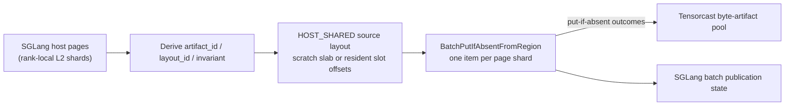

#### 4.2.6 Current read path

For one retrieval batch, the current read-side flow is:

1. SGLang computes the ordered candidate page identities for the request or
   prefix continuation.
2. The backend uses `BatchExists(...)` to determine the consecutive hit span.
3. The backend chooses one of two host-native target layouts:
   - ordinary-host mode: one persistent `HOST_SHARED` scratch slab large enough
     for the hit span,
   - allocator-backed mode: freshly reserved destination slots on the exported
     slab.
4. The backend issues `BatchGetIntoRegion(...)` so Tensorcast materializes the
   hit pages directly into that `HOST_SHARED` target layout.
5. If scratch-slab mode is in use, the backend copies each resolved page slice
   from the slab into the target L2 host pages.
6. If allocator-backed mode is in use, the backend revalidates slot generation
   and only then makes the fetched pages visible to HiCache/radix state.
7. SGLang later decides whether to load those host pages back to L1 device
   memory.

This preserves the v1 ownership rule:

- Tensorcast does not mutate live L1 KV state directly for prefix share,
- the retrieval result becomes visible to SGLang first as host/L2 pages.

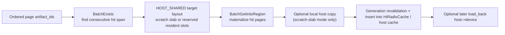

#### 4.2.7 Current host-native region model, allocator residency, and remaining work

The current prefix-share implementation already has the host-native region model
that earlier bring-up work targeted:

- `BatchPutIfAbsentFromRegion(...)` and `BatchGetIntoRegion(...)` both operate
  on `HOST_SHARED`,
- Tensorcast daemon exports long-lived host-shared slabs,
- SGLang maps those memfd-backed slabs locally,
- and SGLang can optionally perform one long-lived `cudaHostRegister(...)` on
  allocator-backed slabs when host-to-device load-back performance matters.

The important semantic point is:

- `HOST_SHARED` changes only the **local placement boundary** between SGLang and
  the local Tensorcast daemon,
- it does **not** change page identity,
- it does **not** change shard-home routing or authority,
- and it does **not** let remote daemons write directly into SGLang memory.

There are now two concrete SGLang-side shapes built on that same model:

1. **scratch-slab transport**
   - Tensorcast daemon exports one long-lived `HOST_SHARED` scratch slab per
     rank,
   - SGLang rank maps that slab locally and reuses it across batches,
   - `batch_set_v1(...)` copies ordinary L2 pages into that slab before issuing
     `BatchPutIfAbsentFromRegion(...)`,
   - `batch_get_v1(...)` fills that slab via `BatchGetIntoRegion(...)` and then
     copies into ordinary L2 pages.
2. **allocator-backed direct host residency**
   - Tensorcast daemon exports one long-lived memfd-backed host slab per rank,
   - `HostKVCache` allocates L2 pages directly from that slab,
   - one allocator `slot` corresponds to one HiCache KV page,
   - each slot carries a monotonically increasing `generation`,
   - `batch_set_v1(...)` and `batch_get_v1(...)` reference those page offsets
     directly in `source_layout` and `target_layout`.

With allocator-backed residency, the data path becomes:

- write side:
  - `L2 page already lives in Tensorcast-exported HOST_SHARED slab`
  - `BatchPutIfAbsentFromRegion(...)` references page offsets directly
  - this removes the extra SGLang-side staging copy, but it does **not** imply
    that Tensorcast already has a CPU-source direct-RDMA export path
  - therefore the first allocator-backed direct write path SHOULD continue to
    use the existing
    Tensorcast communicator/export transport on the daemon side; CPU-source
    direct RDMA is follow-up communicator work rather than part of this
    milestone
- read side:
  - `BatchGetIntoRegion(...)` fills the destination page offsets directly
  - the intended fast path is direct-write into the exported slab's
    `ptr + length` destination window rather than filling an intermediate GPU or
    host staging buffer first
  - no extra SGLang-side staging copy is needed

Allocator-backed direct-host data flow:

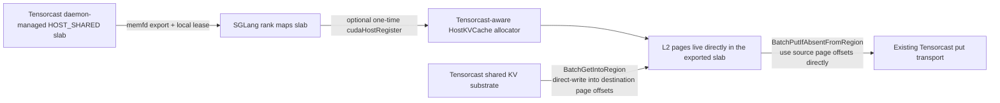

Why the `cudaHostRegister(...)` step is still desirable:

- it is orthogonal to shared-memory export,
- it makes the resulting host pages more suitable for later SGLang
  `L2(host) -> L1(device)` copy-back,
- and it avoids introducing a second pinned staging pool when the exported slab
  itself can serve as the long-lived pinned host region.

Pinned-host operational policy:

- pinning is a performance optimization layered on top of `HOST_SHARED`, not a
  correctness requirement for host-region batch `put/get`,
- long-lived `cudaHostRegister(...)` SHOULD be applied to allocator-backed slabs
  rather than to one-off or per-batch temporary buffers,
- and each TP rank SHOULD manage its own independently exported slab because
  HiCache residency and allocator state are rank-local.

##### Host-slab and slot residency state machine

For allocator-backed direct residency, one allocator slot is the ownership
unit:

- one slot corresponds to one HiCache KV page,
- one batch operation may cover multiple slots,
- adjacent slots MAY later be coalesced into a larger `ptr + length` transport
  range for efficiency,
- but correctness and reuse protection still attach to the covered slots.

`generation` semantics:

- every slot carries a monotonically increasing `generation`,
- the generation is bumped when a freed slot re-enters the allocatable pool
  before it may be reused,
- any in-flight `get` completion, local bookkeeping record, or later callback
  that still refers to the old generation MUST be treated as stale and ignored,
- this is the slot-generation mechanism that prevents ABA when one page slot is
  freed,
  reused for another logical page, and then receives a delayed completion from
  the old lifetime.

Minimal slot token:

- the request path MUST carry enough information to identify not only the slab
  byte range but also the intended slot lifetime,
- the minimum logical fields are:
  - `region_id`
  - `memory_kind=HOST_SHARED`
  - `slot_index`
  - `slot_generation`
  - `offset_bytes`
  - `length_bytes`
- the first safe rollout SHOULD send one logical slot token per KV page even if
  adjacent slots are later coalesced internally by the daemon,
- transport-side coalescing is an execution optimization only; correctness MUST
  continue to validate each requested slot token against the expected
  generation.

Pin and eviction rules:

- SGLang owns per-slot liveness; the daemon owns only slab lease and local
  region validity,
- any slot in `SlotReserved`, `GetInFlight`, or `PutInFlight` MUST hold a
  positive in-flight refcount or pin on the SGLang side,
- HiCache eviction MUST skip pinned slots and MUST NOT recycle them into the
  free list,
- `BatchGetIntoRegion(...)` SHOULD target freshly reserved slots that are not
  yet visible in the radix tree,
- those slots become visible to normal HiCache lookup only after the `get`
  completes successfully and the generation still matches,
- `BatchPutIfAbsentFromRegion(...)` operates on already-resident source slots,
  so a put only pins the slot against eviction; it does not transfer ownership
  of slot lifetime to TensorCast,
- the allocator MUST bump `generation` only after the slot has left all radix
  structures, all in-flight refs are zero, and the slot transitions back to
  `SlotFree`.

The intended lifecycle is:

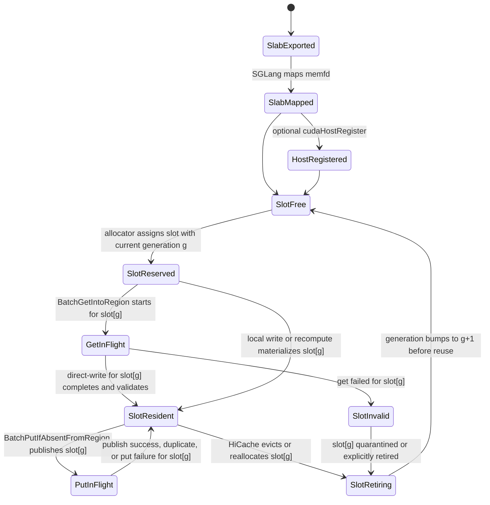

Important ownership rule:

- the slab lifetime is long-lived and daemon-governed,
- page allocation and eviction are frequent and SGLang-governed,
- and one page MUST NOT imply one Tensorcast region object.

The allocator therefore SHOULD manage page offsets inside one long-lived slab
rather than repeatedly creating and destroying region objects.

Allocator-slab failure rule:

- one failed `batch_get_v1(...)` or `batch_set_v1(...)` on allocator-backed direct L2
  residency SHOULD invalidate only the affected page slots,
- it SHOULD NOT retire the whole slab or invalidate unrelated resident pages,
- and slab replacement SHOULD remain a rare control-path recovery for fatal
  slab-level faults rather than a normal response to one page failure.

`SlotInvalid` semantics:

- `SlotInvalid` means the bytes currently stored in that slot are not trusted as
  a valid HiCache L2 KV page,
- an invalid slot MUST NOT be inserted into the radix tree, returned as a cache
  hit, or reused in-place without retirement,
- `SlotInvalid` is entered for target-side `get` failures, partially written or
  unverified fills, or another detected corruption of the slot's current
  lifetime,
- ordinary `put` failure does **not** imply `SlotInvalid` for the source slot,
  because `put` reads from an existing resident page and does not mutate its
  local bytes,
- once a slot becomes invalid, the only valid next step is retirement:
  remove it from any provisional bookkeeping, wait for in-flight refs to drain,
  bump generation, and return it to `SlotFree`.

Allocator-backed read or write scope clarification:

- the zero-copy win is defined first at the SGLang <-> local-daemon
  boundary,
- `batch_get_v1(...)` SHOULD use Tensorcast direct-write into destination
  `HOST_SHARED` slots or contiguous slot runs,
- `batch_set_v1(...)` SHOULD publish from those source slots directly without an
  extra SGLang staging copy,
- but allocator-backed direct residency does **not** require a new CPU-source
  direct-RDMA communicator
  path for put; that remains follow-up transport optimization work inside
  Tensorcast.

Slab teardown order:

1. Stop handing out new slots from the slab and reject new batch `put/get`
   operations that would target it.
2. Drain all in-flight slot refs so no slot remains in `GetInFlight` or
   `PutInFlight`.
3. Remove or retire any remaining resident slots from radix-visible state.
4. Bump generation for every retired slot that will re-enter the free pool.
5. If the mapping was host-registered, perform `cudaHostUnregister(...)` on the
   local mapping.
6. Unmap the memfd from the SGLang rank.
7. Release the local slab lease so the daemon may reap the slab.

This order is normative for allocator-backed direct host residency because
reversing it can leave pinned or in-flight slot references pointing at unmapped
or re-exported host memory.

Remaining follow-up work after the current implementation is narrower:

- request-transfer-specific `PublishManifest` / `hydrate(publish_manifest=...)`
  support is still missing,
- prefix-bundle programmability is still an optional future layer rather than a
  public API,
- and put-side CPU-source direct-RDMA transport is still a later optimization,
  not a requirement for the current correctness or zero-extra-copy local
  boundary.

### 4.3 Relationship to current SGLang hashing

The shared substrate SHOULD preserve SGLang's existing page-hash semantics and
prefix-chain hints:

- page hash values derived from token sequences,
- optional `prefix_keys` chain passed to storage backends,
- existing host-page indexing and page-aligned IO behavior.

This avoids inventing a second identity system for the same KV content.

### 4.4 Bundle metadata and transfer-handle metadata

The integration SHOULD support two distinct metadata families:

- **Prefix bundle metadata**
  - maps a prefix identity to an ordered set of page artifacts.
- **Request-transfer metadata**
  - consists of:
    - a generic Tensorcast artifact manifest over page artifacts, and
    - an opaque engine-owned resume manifest needed for decode continuation.

Prefix-share bundles and request-level transfer snapshots MAY share the same
page artifacts.

The engine-owned request-resume payload MUST NOT be represented as a separate
Tensorcast byte artifact in the dataplane.

#### 4.4.1 Prefix bundle metadata record schema

The integration SHOULD define one canonical prefix bundle metadata schema so
prefix prewarm, inspection, and repair logic do not invent incompatible record
shapes.

Recommended minimal schema:

```yaml
schema: sglang.tensorcast.prefix_bundle.v1
prefix_bundle_id: pfxb:v1:sha256(...)
created_at_ms: 1774223000123
expires_at_ms: 1774223600123
state: ready

identity:
  model_fingerprint: llama3_70b_fp16
  kv_layout_id: sglang.kv.mha.page16k.v1
  tp_size: 8
  pp_size: 1
  attention_arch: mha
  prefix_keys_digest: sha256(...)
  terminal_prefix_hash: "..."
  matched_tokens: 1024
  logical_page_count: 64

rank_shards:
  - tp_rank: 0
    pp_rank: 0
    ordered_pages:
      - logical_page_index: 0
        artifact_id: cgid:byte_artifact~...
        page_hash: "..."
        layout_id: sglang.kv.page_shard.v1
      - logical_page_index: 1
        artifact_id: cgid:byte_artifact~...
        page_hash: "..."
        layout_id: sglang.kv.page_shard.v1
  - tp_rank: 1
    pp_rank: 0
    ordered_pages: [...]

constituent_digest:
  alg: sha256
  hex: "..."
```

Recommended validation rules:

- `prefix_bundle_id` is deterministic for the same logical prefix identity and
  layout/topology contract,
- `ordered_pages` is strictly ordered by `logical_page_index` within each rank
  shard,
- all referenced `artifact_id` values point to the same page byte artifacts
  used by the shared substrate,
- and `state=ready` means the referenced page closure is readable and
  layout/topology compatible for that bundle identity.

#### 4.4.2 Prefix bundle invalidation rules

A prefix bundle SHOULD be treated as stale if any of the following becomes
true:

- a referenced page artifact is missing or unreadable,
- a referenced page's layout is incompatible with `identity.kv_layout_id`,
- the observed TP/PP topology is incompatible with the bundle identity,
- the referenced page set no longer matches `constituent_digest`,
- or the bundle has passed `expires_at_ms`.

#### 4.4.3 PublishManifest and EngineOwnedManifest schema

For request-level transfer, the exported metadata shape SHOULD be:

```yaml
publish_manifest:
  schema: tensorcast.publish_manifest.v1
  artifact_manifest: <ManifestResult>
  engine_owned_manifest:
    engine: sglang
    schema: sglang.engine_owned_manifest.v1
    version: 1
    encoding: json
    created_at_ms: 1774223000123
    expires_at_ms: 1774223060123
    artifact_manifest_digest: "<artifact_manifest.key_set_digest_hex>"
    payload_sha256: "..."
    payload: "<opaque engine-owned resume payload>"
```

For the initial SGLang v1 profile, the opaque payload SHOULD minimally carry a
compatibility envelope like:

```yaml
payload:
  schema: sglang.request_bundle_payload.v1
  transfer_mode: prefill_closed_prompt_reuse
  logical_request_id: "req-123"
  cutoff_token_count: 11712
  frozen_last_page_index: 365
  tail_valid_tokens: 0
  prompt_token_digest:
    alg: sha256
    hex: "..."
  compatibility:
    model_fingerprint: llama3_70b_fp16_ckpt42
    kv_layout_id: sglang_kv_page_v2_page_blob_direct_torch.float16_ps32_mha
    dtype: float16
    page_size: 32
    tp_size: 2
    pp_size: 1
    attention_arch: mha
    required_ranks:
      - tp_rank: 0
        pp_rank: 0
      - tp_rank: 1
        pp_rank: 0
```

The current SGLang payload keeps the compatibility name
`prefill_closed_prompt_reuse`, but the normative v1 meaning is still
full-prompt, prompt-only publication rather than full decode-state handoff.

Recommended interpretation:

- `artifact_manifest` is the generic Tensorcast-visible description of the page
  artifact closure for the published snapshot.
- `engine_owned_manifest` is the engine-owned resume payload. Tensorcast core
  should transport it but not interpret its payload.
- the entire `publish_manifest` object is the external transfer handle; there
  is no second controller-facing string `transfer_handle`.
- `payload` is control-plane data, not a Tensorcast dataplane object.

Recommended rules:

- `engine_owned_manifest.artifact_manifest_digest` MUST bind the opaque resume
  payload to exactly one generic artifact manifest.
- `payload_sha256`, when present, SHOULD cover only the control-plane payload
  bytes in `engine_owned_manifest.payload`; it is not a required re-hash of KV
  page data.
- the initial SGLang v1 profile SHOULD validate at least:
  - `model_fingerprint`
  - `kv_layout_id`
  - `dtype`
  - `page_size`
  - `tp_size`
  - `pp_size`
  - `attention_arch`
  - `required_ranks`
  - `cutoff_token_count`
  - `prompt_token_digest`
- the initial SGLang v1 profile SHOULD treat `cutoff_token_count` as the full
  prompt token count for the request rather than an aligned prefix cutoff.
- the closed byte-artifact set still remains page-granular in v1.
- if the full prompt ends inside a partially filled page, the source SHOULD
  record the trailing prompt remainder in `tail_valid_tokens` rather than
  failing the whole request-bundle publication.
- the initial SGLang v1 profile SHOULD NOT directly transfer the partial tail
  page bytes; `tail_valid_tokens` is the control-plane expression of that
  remainder while the artifact closure stays page-granular.
- target-side hydrate MUST fail closed on compatibility mismatch rather than
  attempting to reinterpret the bundle.
- if the engine wants a string `publish_id` / `snapshot_id` for observability
  or debugging, it SHOULD place that identifier inside the opaque
  `engine_owned_manifest` payload or envelope rather than inventing a second
  authoritative transfer handle.
- `PublishResult.publish_manifest` and `hydrate(publish_manifest=...)` are the
  canonical target integration surfaces and are implemented in Tensorcast core
  today.

### 4.5 Manifest alignment

Tensorcast `ManifestResult` and `ManifestArtifactSetBridge` should be treated as
the generic/exported artifact-manifest representation when leaving the engine
boundary.

That means:

- the EngineAdapter should not invent an incompatible second artifact-manifest
  format,
- request-level `publish()` should return an `artifact_manifest` that points
  back to the same underlying page artifacts used by prefix share,
- and `EngineOwnedManifest` should bind to that same artifact manifest rather
  than duplicating the page-artifact truth independently.

### 4.6 TP>1 shard ownership and rank-qualified storage identity

When `TP > 1`, the shared substrate SHOULD treat per-rank KV shards as distinct
physical objects even when they correspond to the same logical token prefix.

In practice, this means:

- each TP rank continues to own its local device / host page buffers,
- each TP rank continues to own its local radix / host-cache structures,
- physical storage identity MAY include TP/PP rank qualification or an
  equivalent namespace,
- and bundle metadata is responsible for reassembling one logical prefix bundle
  or request bundle from those per-rank shards.

This matches the current SGLang mental model:

- token-prefix identity is shared logically across ranks,
- physical page placement and bytes remain rank-local.

### 4.7 No coordinator on the prefix-share hot path

The shared substrate SHOULD NOT require a central coordinator for ordinary
page-level prefix-share `exists/get/set`.

Instead:

- each rank publishes or fetches its own shard pages,
- SGLang's existing TP synchronization remains authoritative for a common hit
  length, insertion boundary, and completion progress,
- and the coordinator is reserved for higher-level request-bundle operations
  such as programmable `publish` / `hydrate` / `evict_local`.

Coordinator-free hot path does not mean "no synchronization". It means:

- page-level IO stays rank-local,
- while cross-rank consistency continues to use SGLang's existing TP collectives
  and HiCache rules rather than adding a new Tensorcast control hop per page.

### 4.8 Page state models owned by the shared runtime

The shared runtime SHOULD define at least two distinct state models for pages:

- a local placement-oriented state used at the engine / host-buffer boundary,
- a publication-registry state used for deduplication and closure.

These are related but not identical.

#### 4.8.1 Publication-relevant local page placement state

This state compresses the placement information that matters to Tensorcast
integration. It is not intended to mirror every internal SGLang cache detail.

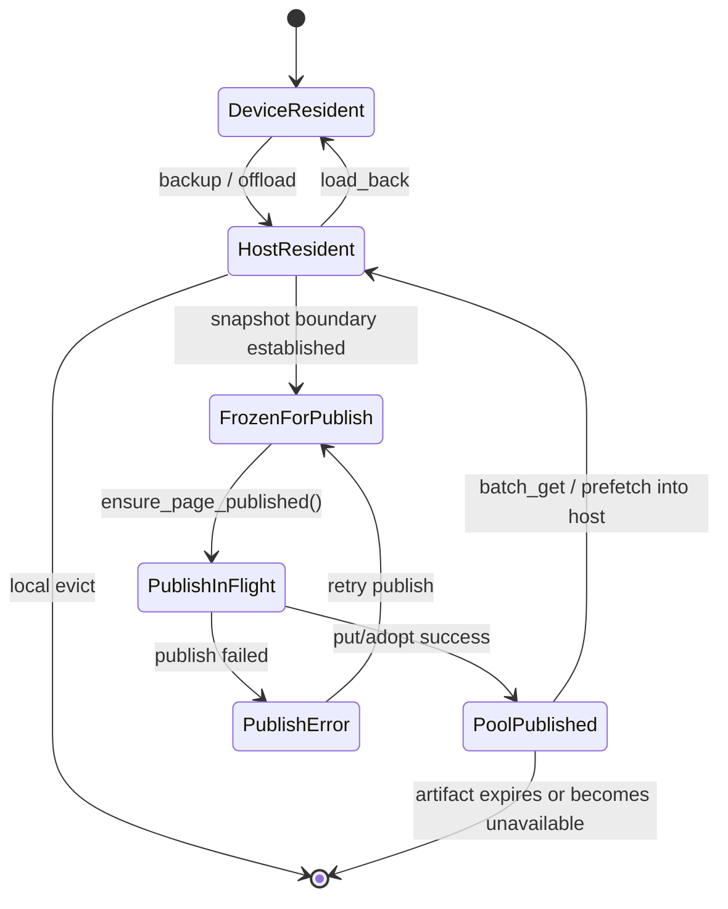

Recommended interpretation:

- `DeviceResident`: page exists only as live engine-side device KV state for the
  purposes of Tensorcast integration.
- `HostResident`: page bytes are present in SGLang host memory and can be used
  for prefix-share read or publication preparation.
- `FrozenForPublish`: the page has an immutable snapshot boundary for one
  publication attempt.
- `PoolPublished`: the shared runtime can treat the page artifact contract as
  satisfied in Tensorcast.

#### 4.8.2 Page publication registry state

This is the per-page coordination state owned by the SGLang-side shared runtime.

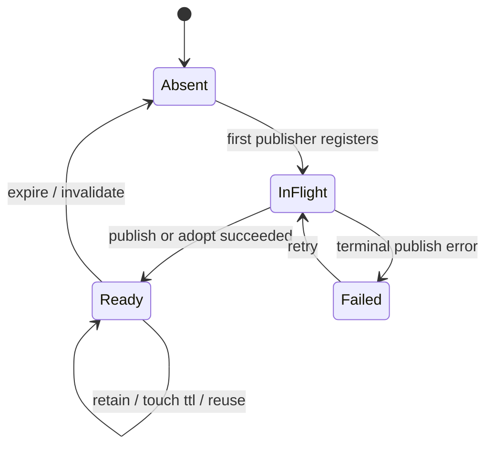

Recommended semantics:

- `Absent`: no usable distributed publication is currently known.
- `InFlight`: some rank or bundle-level workflow is actively trying to satisfy
  the page publication contract.
- `Ready`: the page is published with usable identity and retention.
- `Failed`: the most recent publication attempt failed and should not be treated
  as ready.

---

## 5) Upper Interface A: Prefix Share Data Plane

### 5.1 Design choice

Prefix share SHOULD be integrated as an internal Tensorcast-backed HiCache data
plane, not as an external caller-driven programmable workflow.

Operationally, this means Tensorcast should look more like:

- a Mooncake-style storage backend

than like:

- a per-request external controller action.

### 5.2 Recommended integration point

The recommended SGLang integration boundary is:

- `HiRadixCache` + `HiCacheController`

not just:

- `HiCacheStorage` in isolation.

Reason:

- `HiCacheStorage` only exposes page-store verbs,
- while the real prefix-share semantics also depend on radix-tree ownership,
  prefetch thresholds, cancellation, and insertion semantics controlled by
  `HiRadixCache` and `HiCacheController`.

In practice, the first shippable implementation can still expose a
`TensorCastHiCacheStorage`-like surface, but it should be backed by a shared
runtime that understands the broader KV substrate.

### 5.3 Required backend shape

The prefix-share backend SHOULD provide a Mooncake-like internal API:

- `batch_exists(keys, extra_info)`
- `batch_get_v1(keys, host_indices, extra_info)`
- `batch_set_v1(keys, host_indices, extra_info)`

Key properties:

- batch-oriented,
- page-oriented,
- compatible with host-pool zero-copy or near-zero-copy paths,
- able to honor `prefix_keys` as an additional lookup hint.

### 5.4 v1 memory-hierarchy constraint

For v1, the shared KV substrate SHOULD be integrated at the existing
SGLang HiCache host/L2 boundary.

Concretely, the recommended first implementation is:

- SGLang remains responsible for L1(device) <-> L2(host) movement,
- the Tensorcast-backed shared substrate handles L2(host) <-> distributed pool
  publication and retrieval.

This means v1 does not require:

- direct L1-GPU -> shared-pool zero-copy publish for the prefix-share path,
- direct shared-pool -> L1-GPU zero-copy fetch for the prefix-share path,
- or bypassing SGLang's current host-pool-based HiCache flow.

The reason is pragmatic:

- this keeps the integration minimally invasive to the current SGLang HiCache
  architecture,
- preserves the existing `HiCacheController` / host-pool scheduling model,
- and matches the existing Mooncake-like storage backend contract.

Under the current Tensorcast byte-artifact fast-path, the active implementation
uses `HOST_SHARED` regions rather than reusable GPU staging buffers. That does
not change the memory-hierarchy contract:

- SGLang still owns `L1 <-> L2`,
- Tensorcast still owns `L2 <-> distributed pool`,
- and the hot path remains host/L2-facing even when allocator-backed direct
  residency removes extra local host copies.

Tensorcast GPU fast paths such as CUDA-IPC-backed mapped-target materialization
remain valuable, but they should be treated as later optimizations or
request-transfer-specific accelerations, not as the baseline assumption for the
v1 prefix-share substrate.

### 5.5 Prefix-share read path

The intended flow is:

1. SGLang matches in-memory prefix using `HiRadixCache`.
2. On storage-backed continuation, SGLang computes page hashes and optional
   prefix chain.
3. The Tensorcast-backed backend checks existence for consecutive pages.
4. Matching pages are fetched into host memory.
5. SGLang inserts the returned pages into its host/radix structures.
6. Later, SGLang loads them from host to device as usual.

This path MUST remain engine-owned and local to SGLang's hot path.

```mermaid
flowchart LR
    A["Request arrives on one logical instance"] --> B["Each TP rank checks in-memory radix state"]
    B --> C["Need more prefix pages from substrate?"]
    C -->|No| D["Continue normal execution"]
    C -->|Yes| E["Per-rank compute page hashes + prefix_keys"]
    E --> F["Tensorcast-backed backend batch_exists(...)"]
    F --> G["SGLang TP sync chooses common hit span"]
    G --> H["Tensorcast-backed backend batch_get_v1(...) into host pages"]
    H --> I["Each rank inserts fetched host pages into radix / host cache"]
    I --> J["SGLang later load_back host->device if needed"]
    J --> D
```

### 5.6 Prefix-share write path

The intended flow is:

1. SGLang backs up KV pages from device to host as it already does.
2. On write-through or write-back-to-storage, the Tensorcast-backed backend
   publishes those pages into the shared KV substrate.
3. The storage publication records page identity and, when available, prefix
   chain hints.

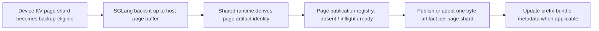

### 5.7 Why this should not use external plans

Using an external caller and `Plan` for synchronous prefix share would be a bad
fit because:

- prefix share is too frequent,
- the hot path needs internal partial-progress handling,
- SGLang already owns scheduling and memory admission,
- `Plan` is a control-plane abstraction, not a per-page low-latency data-plane
  primitive.

### 5.8 Optional programmability for prefix bundles

Programmability can still help for prefix share, but only at a coarse
granularity such as:

- prewarming a known popular prefix bundle to selected nodes,
- debugging or inspecting prefix-bundle availability,
- background repair or rollout.

This is optional and is not the main synchronous prefix-hit path.

---

## 6) Upper Interface B: Request-level Transfer Control Plane

### 6.1 Design choice

Request-level transfer SHOULD use Tensorcast programmability plus an in-process
SGLang instance-agent / EngineAdapter integration.

This is the right place for:

- `publish(engine_request_id=...)`
- preferred `hydrate(publish_manifest=...)`
- compatibility `hydrate(engine_request_id=...)`
- `evict_local(engine_request_id=...)`
- optional `prefetch_manifest_result(...)`

For the current Tensorcast caller surface, request-bundle retention intent is
carried by the `ttl_ms` argument on `publish(...)`, not by `CallContext`.

The explicit-handle rule is:

- `engine_request_id` identifies source-side active request state or a
  retained publishable prompt snapshot,
- successful publish returns `PublishManifest`,
- worker warmup uses `PublishManifest.artifact_manifest`,
- target hydrate SHOULD consume that same `PublishManifest`,
- `evict_local(engine_request_id=...)` continues to operate on live local
  request state rather than on immutable transfer handles.

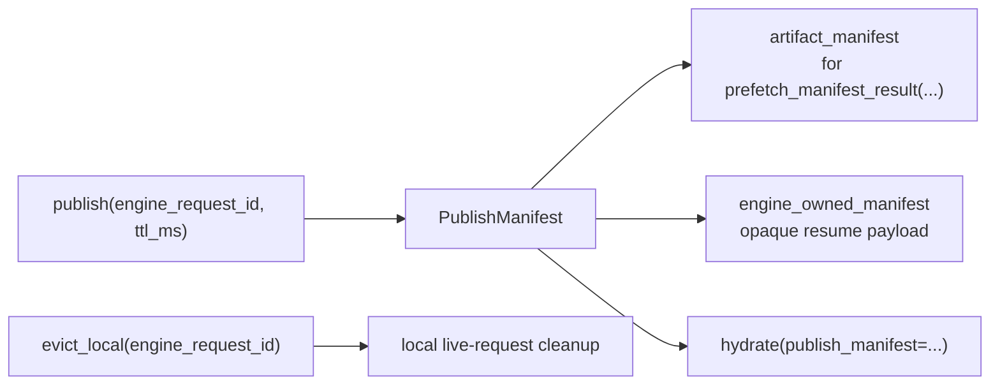

Compatibility note:

- current Tensorcast core exposes the preferred
  `PublishResult.publish_manifest` and `hydrate(publish_manifest=...)`
  surfaces,
- the legacy `hydrate(engine_request_id=...)` path remains compatibility mode
  only,
- and any legacy `hydrate(engine_request_id=...)` convenience should be
  implemented at the controller/helper layer rather than by making the target
  instance resolve transfer snapshots by request id.

### 6.2 Logical instance mapping for TP>1

For request-level transfer, a Tensorcast `instance_id` SHOULD represent one
logical SGLang serving instance / TP group, not one TP-rank process.

Therefore:

- the external caller sees one `instance_id` for one logical instance,
- the external caller issues one `publish` / `hydrate` / `evict_local` call per
  logical instance,
- per-rank fan-out and aggregation stay inside the SGLang integration.

This mapping keeps the controller contract stable even when one SGLang serving
instance internally contains multiple TP ranks.

### 6.3 Coordinator role and external semantics

The request-transfer path SHOULD introduce one SGLang-side coordinator per
logical instance.

The recommended coordinator is the rank-0 control-plane ingress for that TP
group.

Its responsibilities are:

- accept one group-scoped Tensorcast instance-step call for the logical
  `instance_id`,
- validate request identity and layout compatibility,
- fan the operation out to all required ranks,
- gather per-rank results,
- build one group-level `PublishResult`, `HydrateResult`, or `BatchResult`,
- define one success/fail outcome for the whole logical instance.

For standard MHA layouts, the required-rank set is usually all TP ranks. For
layouts such as MLA, the integration MAY optimize which ranks physically publish
pages, but the public programmable semantics remain group-scoped.

### 6.4 Coordinator-to-rank communication path

The preferred implementation is to reuse SGLang's native control-plane path
from the instance-agent execution boundary rather than letting the Tensorcast
daemon side or a separate helper independently contact each TP-rank process.

Concretely, the recommended flow is:

1. The instance-agent sidecar / EngineAdapter receives `publish`, `manifest`,
   `hydrate`, or `evict_local` for one logical Tensorcast `instance_id`.
2. The adapter calls a local SGLang coordinator endpoint for that logical
   instance.
3. The coordinator uses SGLang's existing rank-0 control ingress and internal
   broadcast path to fan the request out to other ranks.
4. Each required rank performs its local shard operation.
5. The coordinator gathers the per-rank results and returns one group-level
   result back through the adapter.

The integration SHOULD avoid ad-hoc direct networking from the instance-agent
boundary to every rank process. The fan-out contract should stay inside
SGLang's native coordinator path.

For quick experiments, a generic collective RPC path is acceptable. For the
real integration, SGLang SHOULD define typed internal request/output objects for
KV publish / manifest / hydrate / evict so that structured results, not just
boolean success, can be returned.

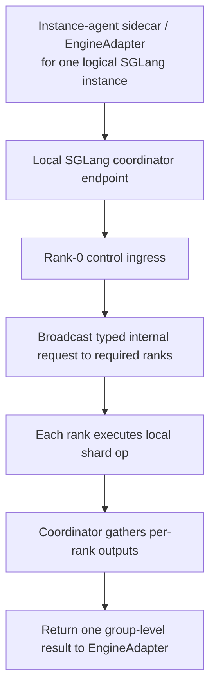

Recommended typed internal schema:

```yaml
KvTransferControlRequest:
  schema: sglang.tensorcast.kv_transfer_control_request.v1
  op_type: publish | hydrate | evict_local
  op_id: uuid
  logical_request_id: string
  instance_id: string

  tp_world:
    tp_size: int
    pp_size: int
    required_ranks:
      - tp_rank: int
        pp_rank: int

  snapshot:
    cutoff_token_count: int
    last_page_index: int
    page_size: int
    radix_last_hash: string | null
    bundle_digest: string

  publish_args:
    publication_mode: substrate_finalize
    allow_force_flush_missing_tail: true
    ttl_ms: int | null

  hydrate_args:
    publish_manifest_digest: string
    artifact_manifest_digest: string
    engine_owned_manifest_sha256: string
    install_mode: prepare_only

  evict_args:
    scope: prepared_bundle | live_request
```

```yaml
KvTransferRankResult:
  schema: sglang.tensorcast.kv_transfer_rank_result.v1
  op_id: uuid
  logical_request_id: string
  tp_rank: int
  pp_rank: int
  status: success | failed | partial

  publish_result:
    snapshot_cutoff_token_count: int
    longest_present_prefix_pages: int
    forced_flush_pages: int
    published_page_count: int
    missing_page_count: int

  hydrate_result:
    hydrated_page_count: int
    install_ready: bool
    prepared_bundle_key: string | null

  evict_result:
    evicted_live_pages: int
    evicted_prepared_pages: int

  error:
    code: string | null
    message: string | null
```

Recommended coordinator semantics:

- `publish` succeeds only when all required ranks have closed the same fixed
  snapshot cutoff and the coordinator can commit one immutable
  `PublishManifest`.
- `hydrate` succeeds only when all required ranks report `install_ready=true`
  for the same `PublishManifest` generation.
- `evict_local` is group-scoped across the logical instance even when physical
  cleanup work happens per rank.

### 6.5 Transfer-handle and data reuse rule

Request-level transfer MUST reuse the shared KV substrate, not create a second
separate storage universe.

That means:

- source-side `publish()` should describe a request bundle over already-stored or
  newly-stored page artifacts,
- target-side `hydrate()` should reconstruct engine-local runtime state from
  those same page artifacts,
- optional worker warmup should prefetch those same artifacts.

It MUST also preserve the handle split:

- `engine_request_id` locates source-side active request state, or a retained
  publishable prompt snapshot, or local cleanup state,
- `PublishManifest` identifies one immutable published snapshot for transfer.

The controller SHOULD pass the entire `PublishManifest` by value to the target
hydrate phase.

The integration SHOULD NOT invent:

- a second controller-visible string transfer handle,
- or a standalone request-metadata byte artifact in Tensorcast dataplane.

It SHOULD instead rely on one SGLang-owned request-bundle metadata record per
active logical request or retained publishable source snapshot. That metadata
stays inside the SGLang integration and is used to:

- identify the fixed publish cutoff,
- enumerate the authoritative ordered page set for that cutoff,
- bind one `PublishManifest` generation to one logical request generation,
- and later prepare target-side decode admission.

Retention implementation rule:

- the `ttl_ms` carried on `publish(engine_request_id=..., ttl_ms=...)` SHOULD
  be translated into the minimum retention lease for all required page
  artifacts of that published snapshot,
- if a page is already present with shorter remaining lifetime, publish should
  retain / touch / re-publish as needed before declaring closure satisfied,
- stronger durable/policy-backed retention is an optional later extension, not
  the baseline v1 request-transfer assumption.

### 6.6 Mixed-state handling between passive page writes and active publish

The integration MUST explicitly support a mixed state where:

- some KV pages have already been passively written into the shared substrate by
  prefix-share or write-through activity,
- some pages are currently in-flight through that passive path,
- and some pages are still absent.

This mixed state is normal and SHOULD be the expected steady-state behavior of a
shared substrate.

Therefore request-level `publish()` MUST NOT mean:

- "upload every page from scratch"

It MUST mean:

- establish a complete request bundle closure over the shared substrate.

Concretely, source-side `publish()` should:

1. resolve the live request plus its SGLang-owned request-bundle metadata,
2. freeze one fixed snapshot boundary expressed at least as token/page cutoff,
3. enumerate the full required page set for exactly that cutoff,
4. for each page:
   - reuse it if already ready,
   - join or adopt compatible in-flight publication when possible,
   - publish it if missing,
   - if it belongs to the chosen cutoff but has not yet reached the shared
     substrate, force or wait for the missing tail flush without chasing newer
     tokens beyond the chosen cutoff,
   - and upgrade retention when mere existence is not sufficient,
5. commit the `PublishManifest` only after closure is satisfied.

For the SGLang v1 request-transfer profile, the fixed snapshot boundary is
defined more narrowly:

- it is the request's full prompt-only boundary, not a full visible-transcript
  boundary,
- emitted decode tokens do not extend page membership,
- decode-only KV never becomes part of the published generation,
- if prompt-page publication for that full prompt boundary is still in flight,
  `publish()` waits for or forces the missing prompt pages up to its deadline
  rather than committing a smaller visible-prefix generation,
- and if the full prompt ends inside a partially filled page, the published
  byte-artifact closure still stays page-granular while `tail_valid_tokens`
  records the non-page-aligned prompt tail.

This gives the two upper interfaces different semantic strength:

- passive prefix-share writes:
  - opportunistic,
  - page-level,
  - best-effort population of the shared substrate.
- active request-level `publish()`:
  - bundle-level,
  - closure-establishing,
  - responsible for completeness and transfer retention.

The request-bundle metadata used in step 1 is an SGLang integration concern:

- it is not a Tensorcast-core registry,
- it is not a standalone Tensorcast dataplane artifact,
- and it is the source of truth for "what exactly belongs to this published
  snapshot generation".

The integration SHOULD also support two publishable source-state shapes:

- an active source request that is still running,
- or a retained prompt snapshot after the ordinary source request has
  completed.

If neither source-state shape remains available, `publish()` MUST fail closed.

### 6.7 Request-level publish flow

The recommended source-side publish flow is:

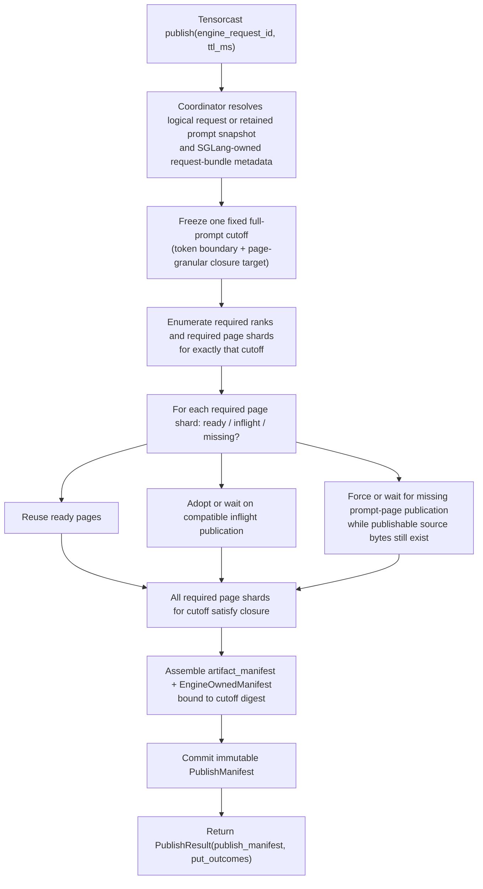

Failure boundary:

- the flow fails before `K` if any required rank or required page shard cannot
  satisfy closure,
- partial page success does not imply request-bundle success.

### 6.8 Request-level hydrate flow

The recommended target-side hydrate flow is:

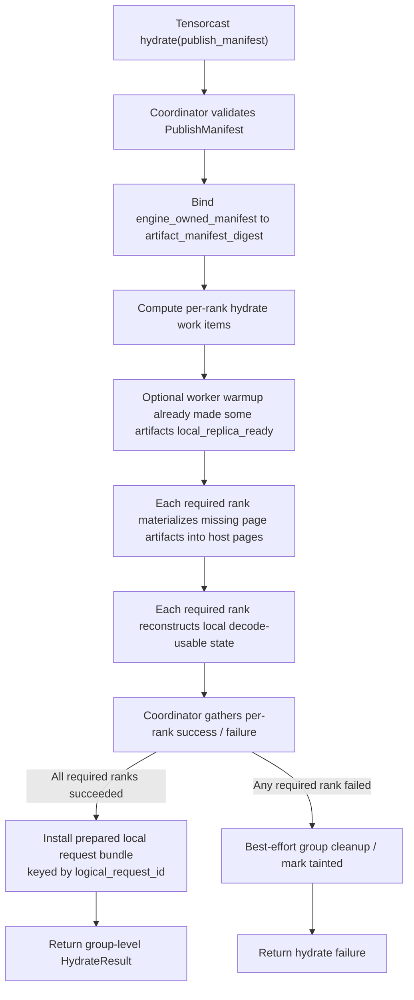

Recommended hydrate semantics:

- artifact fetch/materialization may be internally best-effort at the
  per-artifact level,
- `HydrateResult` may therefore carry partial `get_outcomes` /
  `missing_artifact_ids`-style diagnostic information,
- but the external group-level `hydrate()` call remains fail-closed,
- and success is reported only when the EngineAdapter has installed one
  runnable prepared local request bundle that ordinary decode admission can
  consume.

For the initial SGLang v1 request-transfer profile, this is intentionally not
the same as today's PD-disaggregation decode bootstrap path:

- `hydrate()` prepares local KV/cache state only,
- it does not create a live decode request by itself,
- it does not inject prebuilt first-token metadata,
- and it does not reuse `bootstrap_room` / prebuilt decode semantics as the
  externally visible continuation contract.

In other words:

- partial artifact transport is a diagnostic fact,
- runnable decode preparation is the success criterion.

#### 6.8.1 Target-side ingress after hydrate

The preferred target-side ingress for decode continuation is:

- `hydrate(publish_manifest=...)` prepares target-local request state,
- the controller then sends the ordinary SGLang generate/decode request through
  the normal serving endpoint,
- and that ordinary request carries the same logical request id in the
  caller-visible SGLang `rid` field.

Recommended target-side contract:

1. successful `hydrate()` stores one prepared local request bundle keyed by the
   logical request id carried through the publish/hydrate flow,
2. the prepared bundle is local SGLang integration state rather than a
   Tensorcast directory object,
3. when the controller later sends the ordinary `/generate` request with the
   same `rid`, the target coordinator first re-runs ordinary prompt
   tokenization / normalization and verifies the incoming request against the
   prepared-bundle envelope, including at minimum
   `prompt_token_digest` and `cutoff_token_count`,
4. only after that revalidation passes may the target coordinator claim the
   prepared bundle and resume decode without re-running prefill,
5. if no usable prepared bundle exists for that `rid`, the normal SGLang path
   applies and no hidden transfer recovery occurs,
6. if a prepared-bundle record exists but is stale, tainted, or incompatible
   with the ordinary request, admission SHOULD log a warning, ignore that
   record for this request, and fall back to the ordinary SGLang path.

This keeps the external serving ingress minimally invasive:

- no new public "resume by manifest" HTTP endpoint is required for v1,
- the existing ordinary SGLang request path remains the decode-entry surface,
- and Tensorcast-driven `hydrate()` remains a separate control-plane
  preparation step.

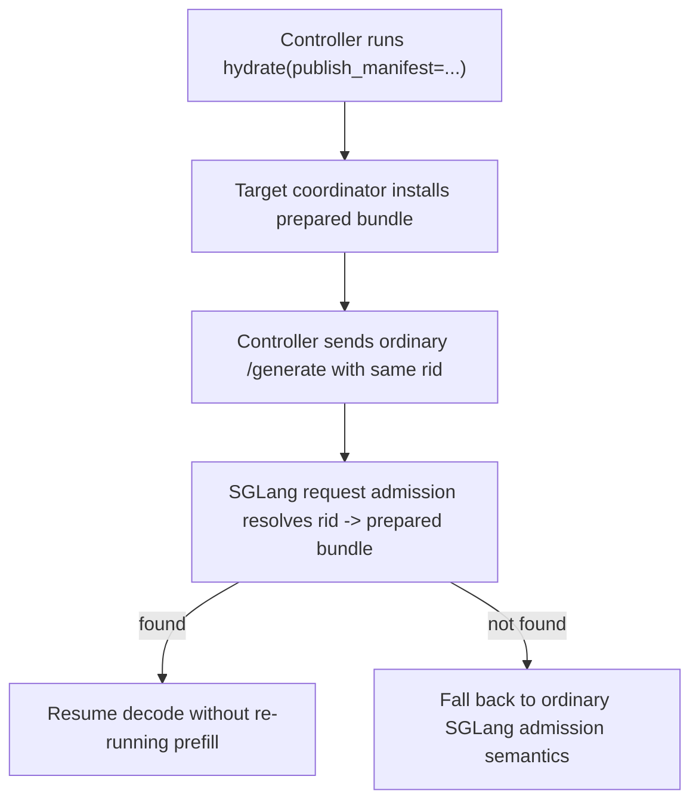

#### 6.8.2 Legacy compatibility hydrate resolution

If we keep `hydrate(engine_request_id=...)` for compatibility, it SHOULD be a
controller-side shim rather than a target-instance-side resolution mechanism.

The controller-side cache / registry:

- belongs to the controller or router control plane,
- stores previously returned `PublishManifest` objects keyed by logical request
  id,
- is not a Tensorcast-core registry feature,
- and is not an SGLang target-instance runtime responsibility.

This compatibility mode SHOULD be explicitly limited to single-controller
deployments. If multiple independent controllers can publish or hydrate the
same logical request id, the compatibility shim should be considered unsafe and
disabled.

Recommended compatibility-resolution flow:

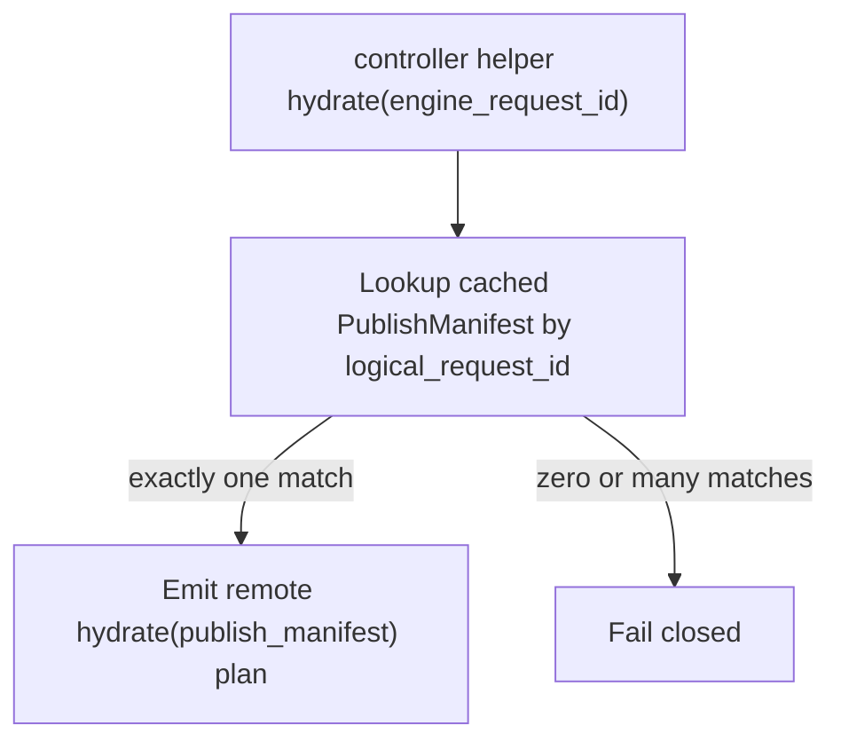

The target SGLang instance SHOULD receive only the explicit-handle form
`hydrate(publish_manifest=...)`.

#### 6.8.3 Initial SGLang v1 profile boundaries

The baseline SGLang request-transfer profile SHOULD stay intentionally narrow:

- the controller provides one explicit stable `logical_request_id`,
- source-side `/generate` uses caller-provided `rid=logical_request_id`,
- `publish(engine_request_id=...)` uses `engine_request_id=logical_request_id`,
- target-side ordinary `/generate` after `hydrate()` uses the same
  caller-provided `rid=logical_request_id`,
- the target runtime is an ordinary serving instance that accepts normal
  `/generate` ingress and executes the first decode step locally.
- the published snapshot always contains only the prompt-only KV state for that
  `logical_request_id`, never decode-token continuation state.
- for v1, the closed byte-artifact set is page-granular over the full prompt
  boundary, and any non-page-aligned prompt tail is carried only through
  `tail_valid_tokens`.

This equality is a v1 integration profile, not a permanent requirement of the
Tensorcast protocol surface.

The initial profile SHOULD reject:

- batch request handoff,
- parallel-sampling handoff,
- session append/replace lineage handoff,
- deployments where post-hydrate ordinary `/generate` may be routed to a
  different DP replica than the one that executed `hydrate()`,
- target decode-only disaggregation instances that do not accept the same
  ordinary `/generate` continuation shape,
- and any attempt to interpret `publish()` as transferring source-emitted
  decode tokens or decode-only KV.

The initial profile MAY still allow `publish()` to be invoked after source-side
decode has already begun, or after the ordinary source request has completed,
provided the resulting published generation is still derived only from the
request's full prompt boundary and never from decode-token continuation.

### 6.9 Instance-agent and EngineAdapter role

In the SGLang v1 design, the Tensorcast instance-step execution boundary is an
instance-scoped instance-agent sidecar service launched by `launch_server()`
for the logical SGLang instance. That instance-agent receives the routed
Tensorcast instance step and delegates the actual SGLang-specific translation
work to the EngineAdapter. It is not tied to any individual FastAPI/uvicorn
worker lifespan.

The SGLang EngineAdapter is responsible for translating Tensorcast instance
steps into SGLang operations:

- `publish`
  - identify the group-scoped request plus its request-bundle metadata,
  - invoke coordinator fan-out when the logical instance has multiple ranks,
  - ensure relevant pages exist in the shared KV substrate,
  - produce one group-level `PublishManifest` output.
- `hydrate`
  - resolve the authoritative `PublishManifest`,
  - invoke coordinator fan-out when the logical instance has multiple ranks,
  - fetch or locate required pages,
  - reconstruct target-side decode-usable KV state across all required ranks,
  - install the prepared local request bundle that ordinary `/generate(rid)`
    admission will consume.
- `evict_local`
  - remove local engine-side request state after handoff or cleanup across the
    whole logical instance.

The EngineAdapter is therefore the bridge from:

- Tensorcast's one-instance-step / one-`instance_id` public surface

to:

- SGLang's potentially multi-rank internal execution model.

The Tensorcast daemon is not the owner of this translation logic. It may remain
the worker-step and shared-substrate host on the same node, but the
instance-step execution host belongs to the SGLang instance boundary.

### 6.10 Request bundle vs prefix bundle

A request bundle is not identical to a prefix bundle.

A request bundle MAY contain:

- a suffix beyond a reusable shared prefix,
- request-scoped decode state,
- engine-specific metadata needed for resume.

But request bundles SHOULD reuse underlying prefix/shared pages whenever
possible.

---

## 7) Shared Runtime Component

### 7.1 Why a shared runtime is useful

To avoid duplicating logic, both upper interfaces should call into one shared
SGLang-side Tensorcast KV runtime component.

This component would own:

- page publication and retrieval,
- bundle metadata assembly and resolution,
- SGLang-owned request-bundle metadata for active or retained publishable
  source requests,
- prepared-bundle admission state for hydrated target requests,
- Tensorcast-specific keying and artifact operations,
- translation between SGLang page hashes and Tensorcast artifact identity.

This shared runtime component MUST live on the SGLang integration side. It is
not a Tensorcast-core responsibility.

### 7.2 Suggested responsibilities

The shared runtime should expose internal operations such as:

- ensure page artifacts are published,
- fetch page artifacts into host pages,
- build prefix bundle metadata,
- build `PublishManifest` from generic artifact-manifest data plus opaque
  `EngineOwnedManifest`,
- resolve request transfer by `PublishManifest`,
- resolve prefix bundle by prefix identity.

For request-level transfer, this shared runtime SHOULD also provide a
coordinator-facing API that can:

- freeze a request snapshot boundary,
- enumerate required ranks and shard contributions,
- assemble one group-level `PublishManifest`,
- resolve one group-level `PublishManifest` back into per-rank hydrate work
  items.

It SHOULD also own a **page publication registry** or equivalent deduplication
mechanism for SGLang-side publication work.

This registry is an SGLang-integration concern, not a Tensorcast-core feature.

Its purpose is to coordinate SGLang-side page publication attempts so that:

- passive prefix-share writes and active request-level publish can deduplicate by
  page identity,
- active publish can observe compatible in-flight passive publication,
- retention upgrades can be applied without pretending that "already exists"
  always means "publish contract already satisfied".

The exact implementation is flexible, but it SHOULD behave like a per-page
publication coordination table with states such as:

- absent,
- in-flight,
- ready,
- failed.

The exact Python module layout is flexible, but the logic should not be split
independently across:

- a storage backend implementation,
- an EngineAdapter implementation,
- and controller-specific helpers

without a shared source of truth.

#### 7.2.1 Source-side `RequestBundleState` record

To make source-side `publish()` deterministic, the shared runtime SHOULD keep
one coordinator-owned record per live logical request or retained publishable
source snapshot. This record is the authoritative local source of truth for:

- the request's full prompt token count,
- the current prompt materialization / publication frontier toward that full
  prompt boundary,
- the fixed cutoff chosen for one publish generation,
- the ordered page membership of that generation,
- the publish manifest generation last committed for that request,
- and any short retained-publish window after the ordinary source request has
  completed.

Conceptual Pydantic-style schema:

```python
from pydantic import BaseModel
from typing import Literal


class RankCoord(BaseModel):
    tp_rank: int
    pp_rank: int


class PageClosureEntry(BaseModel):
    logical_page_index: int
    page_hash: str
    publication_state: Literal["absent", "inflight", "ready", "failed"]
    artifact_id: str | None = None
    host_resident: bool
    last_error: str | None = None


class RankSnapshotCursor(BaseModel):
    tp_rank: int
    pp_rank: int
    latest_token_count: int
    latest_last_page_index: int
    frozen_cutoff_token_count: int | None = None
    frozen_last_page_index: int | None = None
    force_flush_cursor: int | None = None
    ordered_pages: list[PageClosureEntry]


class RequestBundleState(BaseModel):
    logical_request_id: str
    instance_id: str
    engine_request_id: str
    full_prompt_token_count: int
    model_fingerprint: str
    kv_layout_id: str
    tp_size: int
    pp_size: int
    state: Literal[
        "live_tracking",
        "source_retained",
        "snapshot_closing",
        "closing_tail_flush",
        "closure_ready",
        "published",
        "publish_failed",
        "cleaned",
    ]
    snapshot_seq: int
    publish_op_id: str | None = None
    frozen_cutoff_token_count: int | None = None
    frozen_last_page_index: int | None = None
    retained_until_ms: int | None = None
    bundle_digest: str | None = None
    latest_publish_manifest_digest: str | None = None
    required_ranks: list[RankCoord]
    rank_snapshots: list[RankSnapshotCursor]
    created_at_ms: int
    updated_at_ms: int
    last_error: str | None = None
```

Interpretation notes:

- `ordered_pages` is a conceptual schema. Real implementations MAY store this
  in a more compact array-oriented form because page cardinality can be high.
- `publication_state` should be derived from or reconciled with the shared
  page publication registry; it does not replace that registry.
- `latest_token_count` and `latest_last_page_index` refer to the
  current prompt materialization / publication frontier toward
  `full_prompt_token_count` in the SGLang v1 profile. Emitted decode tokens do
  not advance these fields.
- `snapshot_seq` is monotonically increasing per logical request and gives the
  coordinator a local generation number even before a `PublishManifest` exists.
- `latest_publish_manifest_digest` records the last committed external transfer
  handle generation for observability and idempotent retry.
- `source_retained` means the ordinary source request has already completed,
  but the runtime still retains enough prompt-snapshot metadata to publish the
  request's full prompt boundary again before `retained_until_ms`.

Recommended ownership:

- rank 0 owns mutation of `RequestBundleState`,
- non-coordinator ranks contribute per-rank cursors and page membership data,
- and only the coordinator may transition the record into `published`.

#### 7.2.2 Source-side `RequestBundleState` state machine

```mermaid
stateDiagram-v2
    [*] --> LiveTracking
    LiveTracking --> SnapshotClosing: publish(op_id) accepted for full prompt target
    LiveTracking --> SourceRetained: source request completes but prompt snapshot is retained
    SourceRetained --> SnapshotClosing: publish(op_id) accepted for retained full prompt target
    SnapshotClosing --> ClosingTailFlush: fixed full-prompt cutoff sealed on all required ranks
    ClosingTailFlush --> ClosureReady: all required page shards up to cutoff are ready
    ClosureReady --> Published: PublishManifest committed
    ClosingTailFlush --> PublishFailed: any required rank/page terminal failure
    PublishFailed --> SnapshotClosing: retry publish with new snapshot_seq while source snapshot remains publishable
    Published --> LiveTracking: source request remains active after publish
    Published --> SourceRetained: source request completes and retained prompt snapshot remains
    SourceRetained --> Cleaned: retention expiry or explicit cleanup
    LiveTracking --> Cleaned: request released without retained prompt snapshot
    Published --> Cleaned: explicit cleanup without retained prompt snapshot
```

Recommended semantics:

- `LiveTracking`: request is still advancing and the coordinator records the
  latest progress toward the request's full prompt boundary.
- `SourceRetained`: the ordinary source request has completed, but a
  publishable prompt snapshot is still retained locally for a bounded window.
- `SnapshotClosing`: one publish generation has claimed a fixed cutoff and
  ranks are sealing page membership for exactly that cutoff.
- `ClosingTailFlush`: the system is forcing or waiting for missing prompt-page
  shards up to the chosen cutoff while carrying any non-page-aligned prompt
  tail only as metadata, and it is not chasing newer decode tokens.
- `ClosureReady`: all pages required for the chosen cutoff satisfy the publish
  contract and the coordinator can assemble `PublishManifest`.
- `Published`: one immutable generation exists; the source may still be active
  or retained and may later publish a newer generation.
- `PublishFailed`: the chosen cutoff could not be closed and no external
  success was reported.

#### 7.2.3 Source-side snapshot closure algorithm

Recommended coordinator algorithm:

1. Resolve `RequestBundleState` by `logical_request_id`, using either the
   active source request or a retained publishable prompt snapshot.
2. Increment `snapshot_seq` and assign `publish_op_id`.
3. Freeze one cutoff:
   - `frozen_cutoff_token_count`
   - `frozen_last_page_index`
   - derive that cutoff from the request's full prompt token count; emitted
     decode tokens never extend the cutoff,
   - if prompt prefill or prompt-page publication has not yet reached that full
     prompt boundary, wait only up to the publish deadline rather than
     immediately committing a smaller visible-prefix generation,
   - for the initial SGLang v1 profile, keep the artifact closure
     page-granular: `frozen_last_page_index` covers the largest fully closed
     prompt page, while any trailing non-page-aligned prompt remainder is
     carried in `tail_valid_tokens` rather than by directly transferring a
     partial tail page.
4. Broadcast that cutoff to all required ranks.
5. Each rank seals its `RankSnapshotCursor` to that cutoff and returns the
   ordered page list for exactly that cutoff.
6. For each page shard in cutoff order:
   - adopt if `publication_state=ready`,
   - join/wait if `publication_state=inflight`,
   - if `absent`, call a rank-local `force_flush_to_cutoff()` path that pushes
     the missing host-page shard into the shared substrate while publishable
     source bytes still exist,
   - fail if `failed`, if host/L2 materialization for the cutoff cannot be
     recovered, or if the source request has already completed and no
     publishable prompt bytes remain for an absent page.
7. Compute `bundle_digest` from the ordered per-rank page identities bound to
   that cutoff.
8. Only after all required ranks report closure satisfied, assemble and commit
   `PublishManifest`.

Recommended implementation rules:

- `force_flush_to_cutoff()` MUST be bounded by the chosen cutoff.
- A page for token frontier `N+1` MUST NOT be pulled into the current publish
  generation if the frozen cutoff is `N`.
- In the SGLang v1 profile, "token frontier" here always means the
  full prompt boundary together with the current materialization / publication
  frontier toward that boundary; emitted decode tokens and decode-only KV never
  enter the published generation.
- If the full prompt ends inside a partially filled page, that tail SHOULD be
  carried in `tail_valid_tokens`; the partial tail page bytes are not directly
  transferred in the initial v1 profile.
- Source request execution MAY continue after the cutoff is frozen; newer
  decode tokens simply remain outside the published generation.
- `publish()` MAY wait for prompt prefill / page publication needed to close
  the full prompt boundary, but it MUST NOT wait for decode continuation or any
  newer prompt mutation.
- If the source request is released and no retained publishable prompt snapshot
  remains before the chosen cutoff can be closed, `publish()` should fail
  rather than invent a partial bundle.

#### 7.2.4 Target-side `PreparedBundleRecord`

To make ordinary `/generate(rid)` admission deterministic after `hydrate()`,
the shared runtime SHOULD keep one target-local record per hydrated transfer
generation.

Conceptual Pydantic-style schema:

```python
from pydantic import BaseModel
from typing import Literal


class RankInstallRecord(BaseModel):
    tp_rank: int
    pp_rank: int
    state: Literal["preparing", "ready", "failed", "cleaned"]
    hydrated_page_count: int
    runnable_prefix_tokens: int
    local_install_handle: str | None = None
    last_error: str | None = None


class PreparedBundleRecord(BaseModel):
    logical_request_id: str
    target_instance_id: str
    publish_manifest_digest: str
    artifact_manifest_digest: str
    engine_owned_manifest_sha256: str
    prepared_hold_set_id: str | None = None
    state: Literal[
        "preparing",
        "prepared",
        "claimed",
        "attached",
        "consumed",
        "failed",
        "evicted",
    ]
    required_ranks: list[RankCoord]
    rank_installs: list[RankInstallRecord]
    claim_token: str | None = None
    active_scheduler_rid: str | None = None
    prepared_bundle_key: str | None = None
    created_at_ms: int
    prepared_at_ms: int | None = None
    claimed_at_ms: int | None = None
    cleaned_at_ms: int | None = None
```

Interpretation notes:

- `PreparedBundleRecord` is local SGLang integration state, not a Tensorcast
  directory object and not a distributed registry entry.
- `publish_manifest_digest` is the primary generation key. The same
  `logical_request_id` may see more than one generation over time.
- `claim_token` is an admission-time compare-and-swap token used to prevent two
  concurrent `/generate(rid)` requests from consuming the same prepared bundle.
- if host-shared slots back the hydrated pages, `prepared_hold_set_id` points
  to an out-of-band local hold table keyed by slot token / generation rather
  than by `page_start` alone.
- that prepared-hold table belongs only to hydrate / claim / cleanup control
  flow and SHOULD NOT be consulted by ordinary radix-prefix match,
  `ongoing_prefetch`, or phase 2-2.5 page-substrate hot paths.

Recommended table key:

- primary key: `(logical_request_id, publish_manifest_digest)`
- secondary admission index: `logical_request_id -> latest prepared generation`

#### 7.2.5 Target-side `PreparedBundleRecord` state machine

```mermaid
stateDiagram-v2
    [*] --> Preparing
    Preparing --> Prepared: all required ranks install runnable state
    Preparing --> Failed: hydrate group failure
    Prepared --> Claimed: ordinary /generate(rid) atomically claims bundle
    Claimed --> Attached: scheduler creates live request from prepared state
    Claimed --> Prepared: admission rollback before live request is created
    Attached --> Consumed: live request owns the state
    Prepared --> Evicted: cleanup without use
    Failed --> Evicted: cleanup
    Consumed --> Evicted: request finished / local cleanup
```

Recommended semantics:

- `Preparing`: hydrate is still materializing/installing state.
- `Prepared`: one runnable bundle exists and is available for exactly one decode
  admission claim.
- `Claimed`: admission has won the race for this bundle but has not yet
  attached it to an SGLang live request object.
- `Attached`: scheduler/live-request construction is in progress using this
  prepared bundle.
- `Consumed`: ownership has moved to the live request; the prepared-bundle
  record is no longer reusable for another decode admission.

#### 7.2.6 Target-side admission binding algorithm

Recommended coordinator algorithm for ordinary `/generate(rid)` after hydrate:

1. Request admission receives caller-provided `rid=logical_request_id`.
2. Coordinator checks for an existing live request with the same logical id.
3. Coordinator checks the prepared-bundle table for that logical id.
4. If no prepared bundle exists:
   - follow the normal SGLang path.
5. If exactly one `PreparedBundleRecord(state="prepared")` exists:
   - run the same incoming prompt tokenization / normalization that ordinary
     SGLang admission would otherwise use,
   - verify the resulting prompt against the prepared-bundle envelope,
     including at minimum `prompt_token_digest` and `cutoff_token_count`,
   - if this revalidation fails:
     - log a warning,
     - do not claim the prepared bundle,
     - follow the normal SGLang path,
   - otherwise:
     - atomically transition it to `claimed`,
     - mint `claim_token`,
     - construct the live request from the prepared bundle,
     - transition to `attached` and then `consumed`.
6. If only stale, tainted, failed, evicted, or compatibility-mismatched
   prepared records exist for that logical id:
   - log a warning,
   - ignore those records for this admission,
   - and follow the normal SGLang path.
7. If a clean prepared bundle is already in `claimed` or `attached`, or if
   multiple clean prepared generations exist:
   - fail closed rather than guessing or stealing ownership.

Recommended conflict rules:

- If a live request already exists for `logical_request_id`, `hydrate()` SHOULD
  reject installing a new prepared bundle for that id.
- If a prepared bundle already exists with a different
  `publish_manifest_digest`, a second hydrate SHOULD fail closed unless the
  existing record has already been cleaned.
- Repeated hydrate with the same `publish_manifest_digest` MAY be treated as an
  idempotent retry.
- Prepared-bundle consumption SHOULD be one-shot. Reusing the same prepared
  bundle for multiple decode admissions should not be the default v1 behavior.
- Incoming-request prompt revalidation failure SHOULD behave like a non-usable
  prepared record for admission: warning + fall back to the normal SGLang path.
- Stale, tainted, failed, evicted, or compatibility-mismatched records SHOULD
  be cleaned best-effort and MUST NOT force ordinary `/generate` to fail when
  the normal prefill/prefix-reuse path remains available.

### 7.3 Bundle state models

The shared runtime SHOULD define explicit lifecycle states for both prefix
bundles and request bundles. These state machines are not Tensorcast-core
objects; they are SGLang integration state.

These lifecycle models are intentionally higher-level than the concrete
coordinator-owned records in:

- `7.2.1 Source-side RequestBundleState`
- `7.2.4 Target-side PreparedBundleRecord`

The concrete records describe implementation state for one coordinator/runtime.
The lifecycle models below describe the broader semantic phases that the
integration exposes and reasons about.

#### 7.3.1 Prefix bundle state

Prefix bundles are background or hot-path share metadata over already-published
or newly-published page artifacts.

```mermaid
stateDiagram-v2
    [*] --> Unknown
    Unknown --> Building: page sequence observed and metadata being assembled
    Building --> Ready: ordered page set is complete enough for prefix-share use
    Building --> Failed: metadata assembly failed
    Ready --> Ready: reused by more requests
    Ready --> Stale: constituent pages expired or metadata invalidated
    Stale --> Building: rebuild from current page set
    Failed --> Building: retry assembly
```

Recommended semantics:

- `Ready` means the bundle can answer prefix-share existence / fetch queries.
- `Stale` means the bundle name may still exist logically, but its page closure
  is no longer trusted.
- `Stale` should be entered whenever the validation rules in
  `4.4.2 Prefix bundle invalidation rules` are violated.

#### 7.3.2 Request bundle state

Request bundles are stronger than prefix bundles because they must satisfy
decode-resume closure for one logical request.

```mermaid
stateDiagram-v2
    [*] --> LiveOnly
    LiveOnly --> SourceRetained: source request completes but prompt snapshot retained
    LiveOnly --> SnapshotClosing: publish begins and snapshot boundary freezes
    SourceRetained --> SnapshotClosing: publish begins from retained prompt snapshot
    SnapshotClosing --> PublishingPages: required page closure is being satisfied
    PublishingPages --> Published: immutable PublishManifest committed
    PublishingPages --> PublishFailed: closure failed
    Published --> Hydrating: target hydrate begins
    Published --> SourceRetained: source request completes and retained prompt snapshot remains
    Hydrating --> Hydrated: all required ranks installed runnable state
    Hydrating --> HydrateFailed: one or more required ranks failed
    Hydrated --> CleanupPending: decode ownership moved, local cleanup optional
    SourceRetained --> CleanupPending: retained publish window expires or explicit cleanup
    CleanupPending --> [*]: cleanup complete or TTL expiry
    PublishFailed --> SnapshotClosing: retry publish
    HydrateFailed --> Hydrating: retry hydrate
```

Recommended interpretation:

- `Published` is the first state in which a request bundle is externally
  authoritative for request-level transfer.
- every successful transition into `Published` SHOULD mint one immutable
  `PublishManifest` generation.
- `SourceRetained` means the request is no longer active, but a later
  prompt-only `publish()` is still possible until cleanup or retention expiry.
- `Hydrated` is target-local success, not global workflow completion.
- `CleanupPending` keeps request-level transfer semantics separate from source
  or target local eviction policy.

---

## 8) Fit With Current Tensorcast Capabilities

### 8.1 What Tensorcast already provides

Current Tensorcast already provides the right building blocks for the
request-level control plane:

- runtime-bound `Plan`,
- worker `prefetch_set` / `prefetch_manifest_result`,
- instance `publish(engine_request_id=...)`,
- legacy `hydrate(engine_request_id=...)`,
- `evict_local(engine_request_id=...)`,
- `ManifestResult` and `ManifestArtifactSetBridge`.

These are necessary building blocks, but not yet the complete target
request-transfer surface.

### 8.2 What Tensorcast does not yet directly provide

Current Tensorcast does not yet directly provide all the primitives needed for
the final explicit-handle request-transfer surface.

The main gaps are:

- a stable public page-store-style batch API tailored for high-cardinality KV
  page IO, rather than today’s lower-level byte-artifact batch-region surfaces,
- explicit public prefix-bundle programmability,
- `PublishResult.publish_manifest`,
- opaque `EngineOwnedManifest` carriage in the instance-step result path,
- `hydrate(publish_manifest=...)`,
- and a public hydrate-by-manifest or hydrate-by-artifact-set instance-step
  surface.

### 8.3 Design consequence

Because of these gaps, the recommended implementation strategy is:

- keep the already-implemented prefix-share path as an internal SGLang
  integration over Tensorcast byte-artifact and region-backed primitives,
- while extending Tensorcast programmability for request transfer with as
  little Tensorcast-core change as possible.

---

## 9) Recommended Implementation Order

### 9.1 Phase 1: shared substrate

Implemented in the current repo:

Implement:

- the shared SGLang-side Tensorcast KV runtime,
- page publication/retrieval.

Goal:

- make Tensorcast usable as the distributed KV pool for prefix share.

### 9.2 Phase 1.5 + Phase 2: byte-artifact-native prefix share and benchmark bring-up

Implemented in the current repo:

Implement:

- the byte-artifact-native batch `exists/get/set` path over `HOST_SHARED`
  regions,
- persistent `HOST_SHARED` scratch-slab transport for ordinary host pools,
- allocator-backed direct host residency with `page_blob_direct`,
  slot-generation protection, and optional `cudaHostRegister(...)`,
- the `share_local` Tensorcast benchmark harness,
- `tensorcast-daemon-mode=share`,
- `tensorcast-daemon-mode=separate`,
- explicit benchmark `rid`,
- source-publication-drain measurement,
- overlap-mode request-pair driving with `--pair-rps` and `--settle-ms`,
- and log-based validation of real HiCache prefix reuse.

Goal:

- make the Tensorcast backend a real SGLang prefix-share backend rather than a
  placeholder topology harness.

### 9.3 Phase 3: request-level EngineAdapter

Implemented in the current repo today:

- Tensorcast-core `PublishManifest` / `EngineOwnedManifest` plumbing across the
  result and instance-step boundary,
- canonical explicit-handle `hydrate(publish_manifest=...)` support plus the
  controller-side compatibility path for legacy `hydrate(engine_request_id=...)`,
- SGLang-side local request-transfer state machines for `publish`,
  `hydrate`, prepared-bundle claim, and `evict_local`,
- real ordinary `/generate` lifecycle wiring for live request tracking and
  prepared-bundle claim / cleanup,
- rank-0 runtime fanout / aggregation for `publish`, `hydrate`, and
  `evict_local` over the live scheduler control path,
- coordinator-owned Tensorcast directory registration / heartbeat for the
  launch_server-managed instance-agent sidecar execution endpoint,
- target-side decode-usable host-resident hydrate install and ordinary
  `/generate(rid)` consume on the normal HiRadix path.

Still required to complete this phase:

Implement:

- remote controller-driven validation from source publish to target ordinary
  `/generate(rid)` decode resume on real instances,
- and any small runtime hardening discovered while doing that validation.

Already validated locally in-repo:

- the external caller benchmark under
  `benchmark/tensorcast_benchmark/kv/request_transfer/`,
- source ordinary `/generate`,
- controller-side `publish` for the full prompt page-granular closure,
- controller-side `hydrate` on the target instance,
- target ordinary `/generate(rid)` consume,
- and `prepared_bundle_verified` with
  `cached_tokens == cutoff_token_count - tail_valid_tokens`.

Goal:

- enable PD transfer using the protocol in
  `tensorcast_kv_protocol.md`.

Optional controller-side helper work, if we decide to keep a convenience
`hydrate(engine_request_id=...)` entrypoint, should stay outside the SGLang
target-instance runtime and simply resolve a cached `PublishManifest` before
emitting the canonical remote `hydrate(publish_manifest=...)` plan.

### 9.4 Future optional programmable prefix bundle operations

If useful later, add coarse-grained programmability for prefix bundles, such as:

- prefix-bundle prewarm,
- rollout to selected nodes,
- debugging and inspection.

This phase is optional and should not block the main two-path integration.

---

## 10) Non-goals and Guardrails

The integration SHOULD avoid these failure modes:

- building one Tensorcast path for prefix share and a separate incompatible path
  for request transfer,
- treating `engine_request_id` as the stable distributed identity for KV pages,
- exposing one Tensorcast `instance_id` per TP rank to the external caller for
  request transfer,
- routing ordinary prefix-share page IO through the request-transfer
  coordinator,
- routing synchronous prefix-hit traffic through external callers and `Plan`,
- reducing Tensorcast to only a thin `HiCacheStorage` replacement without
  reusing it in request-level transfer.

The core guardrail is simple:

- one distributed KV substrate,
- two upper interfaces,
- one consistent identity model.

---

## 11) Summary

The recommended Tensorcast + SGLang KV integration is:

- **shared bottom layer**
  - page artifacts, bundle metadata, shared distributed KV pool.
- **upper interface A: prefix share**
  - internal SGLang hot path,
  - Mooncake-like batch exists/get/set,
  - no per-request external programmability.
- **upper interface B: request transfer**
  - external caller-driven Tensorcast programmability,
  - coordinator-backed logical-instance `publish` / `hydrate` / `evict_local`,
  - optional worker warmup via `prefetch_manifest_result(...)`.

This is the intended design baseline for the implementation work that follows.
